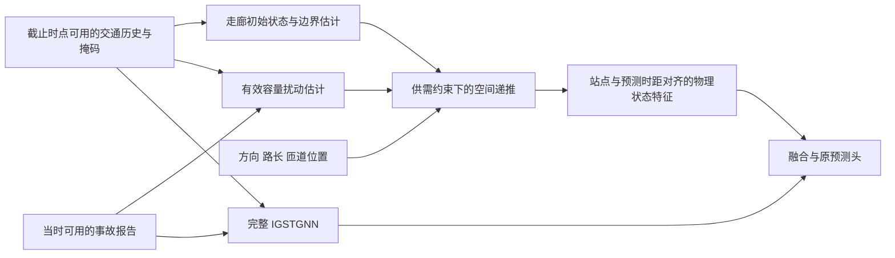

# 有限观测下的事故—容量—传播 IGSTGNN 改进方案

初稿日期：2026-10-09。2026-10-10已完成V2 M3.0独立潜交换及M4.0融合工程接口；真实空间资格、真实训练和收益证据尚未完成。

**2026-10-10开发更新：** 用户V2稿及审查已形成[V2.1执行约定](incident_capacity_propagation_v21_contract.md)。M3.0独立有向潜交换与同容量入口普通递推已实现，随后完成[M4.0历史到截止状态及预测头融合](incident_capacity_fusion_m40.md)。原3604训练X/496站接口和资格清单已适配，真实有向边/边界及可见报告集合仍待闭合，没有真实训练。下文为早期设计记录，状态、主算子和时间约定冲突处以V2.1和M4.0为准，不把潜收支称为车辆守恒。下一任务优先真实图/报告集合适配，再补L1与历史前缀观测外推监督。

开发已拆成[六个模块与逐项验收任务](incident_capacity_propagation_tasks.md)。M1.1的40站包保留用于局部开发；M3.0独立潜交换与M4.0主干融合工程接口已交付。真实连接、边界、报告集合及物理量纲仍待核实，不能把保留全网输出误当多数道路机制覆盖。

**全网适用性修订：** 用户明确要求主架构的必需数据在现有大部分路段上同时具备，不能只靠其余道路回退或未经验证的共享迁移。M1.0a [全网联合审查](network_input_coverage_20261009.md)已完成：496 站三通道数值历史齐备，但单位/源插补未认证；直接事故训练支持仅 230 站、6/14 个方向组。物理方程条件的联合覆盖尚未建立。

**数据准备与当前路线：** M1.0b[扩展审查](incident_expansion_and_architecture_20261009.md)后，M1.0c[全网候选历史与观测诊断](incident_candidate_history_20261009.md)已生成9943事件/496站独立X包。169站低速高占有率代理稀少、4对源序列重复，不能认证逐站容量。M2.1/2.2工程原型、M3.0空间算子及M4.0融合接口已交付；M4适配回到原3604训练清单，不用候选X扩大监督集。尚无真实训练或收益证据，严格CTM保留为有依据的局部参照。

相对化只能消除正乘法单位尺度，不能修复观测聚合/拓扑错误，也不能将无量纲隐状态自动称为真实容量。下文保留原直接递推候选依据，具体物理闭合形式尚未最终确定。

## 研究目标与本次调整

用户明确目标是“事故发生了什么—道路通行能力怎样变化—交通影响如何传播”。对应问题：只有有限事故报告和部分交通观测时，将事故条件通过有效容量接入交通动力学，能否比同输入的普通神经分支更好地改进完整 IGSTGNN？

数据寻找服务于这条机制链。封道车道数、处置日志、事故清除时间和队列真值属于增强信息，不是第一版共同前提。短站对用于局部量纲、观测映射及数值核验；空间传播研究需要跨多个站间区段的走廊，不能把已匹配的 223–499 米短段当成整个实验范围。

本设计更新后续优先级，不修改现有 `PHYSICAL_CONTRACT_REQUIRED` 状态，不把估计状态改称真值。

研究范围补充：三条 40 站走廊是开发起点。正式主实验保留当前 Contra Costa **全部 496 个主线站**及原冻结时间划分；先完成 M1.0 架构适用性判断，正式实验前再完成 M1.5 全网覆盖清单和相应扩展。所有节点保留预测和评价资格，另行披露具体物理算子的适用范围；不将局部改善当成全网改善。全网输出本身不能证明物理机制普适，该扩展尚未实现。

## 两个相互连接的模块

### 1. 事故条件下的有效容量扰动

事故报告提供扰动位置和时间线索，交通历史提供事故已产生的观测迹象。二者共同推断低维容量变化；同样的报告在不同交通状态下不必产生相同参数。

可检验的参数化起点是 `C_i(t) = C_base_i × [1 - support_i × a_i(t)]`，其中 `a` 有界且允许为零。这里的 C 是模型中的有效通行能力，不等于已知的封道数量，也不能由流量下降直接反推容量下降。初版把新增事故条件限制在容量路径，需求和边界由交通历史与道路条件预测，使结构假设可被对照。

`C_base` 优先在训练期校准后固定或跨事件共享；事件相关参数保持低维，并约束时间变化。不能让每个站每个时刻的容量、需求、初始积累、侧向源项同时自由变化，否则它们容易互相补偿。还要检查不同初始化下参数是否稳定；预测相近而参数不同，应报告不可辨识。

首版事故输入沿用 `report_location_v1` 的报告年龄与位置关联。原始 Type/DESCRIPTION 只有核实其在预测时点可用后才扩展，最终 duration 不作输入。没有初始报告快照时，不能通过大模型补写“封了几条车道”。报告时刻也不是事故实际起点。

已有 H1 的指数单调恢复曲线保留为受限参照。空间版候选采用有界、低维、平滑的容量轨迹，并检验允许继续恶化/波动是否必要；不把单调恢复写成数据事实，也不预先宣布更灵活的轨迹一定更好。

### 2. 容量限制下的空间传播

用同向相邻道路区段建立物理连接。每个区段保留车辆积累或密度；相邻区段共用同一个界面流量，由上游发送能力和下游接收能力共同限制。拥堵后下游接收能力降低，从而影响更上游的区段。

这为容量变化到空间影响提供明确路径。容量降低也不必立即导致拥堵：是否积累取决于到达需求和下游状态。车辆向下游行驶与拥堵波可能向上游传播必须分别表达，不能仅用双向图卷积替代这个关系。

沿用原图服务 IGSTGNN 的相关性建模；物理分支另用有道路依据的直接连接。原邻接矩阵非对称并不自动保证每条边可用于车辆守恒。空间范围按道路连续性、站点覆盖与训练事件支持确定，不为了凑长度跨越未知岔路，也不要求整条走廊没有匝道。

已知匝道优先作为交换边界：有可信观测时使用观测历史；没有观测时可采用有范围、低维、共享的边界预测，并单独作敏感性分析。不能给每个 cell 一个无限制残差源来吸收容量误差。边界不足的部分可拆成多个物理区段；只对这些区段内部作相应守恒声明。完整走廊的严格守恒需要完整交换量依据。

## 部分观测如何进入物理分支

流量、速度、占有率是检测器观测；区段密度、容量和队列是待估状态或参数。需显式定义检测器到区段/界面的观测映射与时间聚合，不能默认占有率等于密度，也不能把任意逐站 `q/v` 当作真实区段密度。

历史编码器首先估计状态；在可用历史观测上检查或校正状态与观测的一致性，再从预测截止点向未来递推。未来边界只能预测，gap/Y 不得成为推理输入。历史校正必须遵守报告出现时间，不把后来报告回填成早已在线获知的信息。当前离线条件性协议与真正滚动预测资格继续分开。

现有 v11a 三通道历史可复用，但通道语义、单位与缺失处理仍须核对。状态或容量真值并非训练的必要标签；可以用真实交通观测监督预测。然而，没有独立机制真值时，容量曲线只支持“模型推断的有效扰动”，不能声称恢复了真实事故处置过程。

首版融合复用 H1 的零初始化残差思路，在原预测头之前注入按站点/时距对齐的物理状态。无支持处的直接分支增量为零。此方式保证的是物理分支内部结构，最终神经预测头并不自动满足守恒。物理接口流量与观测有可信映射后，可另行检验辅助观测损失；不能靠任意线性读出宣称最终输出严格守恒。

## 现有实现与新增工作

| 部分 | 现状 | 后续工作 |
|---|---|---|
| 完整 IGSTGNN/fixed | 已有冻结对照与历史结果 | 继续作为主要参照，保留原事故路径 |
| H1 有效容量与点队列 | 已实现并通过合成工程检查 | 复用参数化、对照、时间聚合及融合经验；作为局部参照 |
| `ctm_corridor_step` | 已有无匝道内核及数值测试 | 尚缺真实走廊映射、部分观测状态估计、边界及融合 |
| 三条短段的道路匹配 | 已完成静态资料匹配 | 为扩展多站走廊提供锚点，不作为传播研究的全部范围 |
| 封道/处置时间序列 | 未取得可对齐的历史版本 | 继续定向寻找；缺失时用有边界的潜在容量模型 |

## 必须能区分的实验解释

| 对照 | 要回答的问题 |
|---|---|
| 完整 fixed | 最终是否优于原研究起点？ |
| fixed + 同样三通道/道路信息的普通空间递推分支 | 收益是否仅来自更多输入、参数或记忆？ |
| fixed + 物理分支，新增容量路径不接事故 | 交通历史和物理结构本身提供多少收益？ |
| fixed + 物理分支，新增容量路径接事故 | 在同样物理结构下，事故条件是否有额外收益？ |
| 完整候选与去除空间耦合的局部分支 | 空间传播是否比独立局部队列有用？ |

新增事故路径关闭不等于整个 IGSTGNN 不使用事故。普通参照应得到相同历史、报告、道路资料、时间范围、边界信息和可比记忆；披露参数量差异。条件允许时补齐“物理/普通 × 新增事故条件开/关”的 2×2 设计，避免把事故条件与物理转移的交互混在一起。

沿用冻结时间划分、相同训练预算和成对随机种子；先看整体及预先定义走廊/时距的预测误差，再看模型中的容量与传播。走廊、基本图校准及诊断阈值用训练数据或独立道路资料确定，不根据验证 Y 反向挑选。最终 test 继续封存。事故位置打乱、条件关闭与同 checkpoint 干预只作为模型依赖诊断，不是事故因果效应证明。

## 思想来源及迁移边界

1. **Daganzo，CTM，Transportation Research B，1994**，DOI [10.1016/0191-2615(94)90002-7](https://doi.org/10.1016/0191-2615(94)90002-7)。方法核读依据 [1993 前驱报告](https://escholarship.org/content/qt0b6612tk/qt0b6612tk.pdf) §2、§3、§6；仓储封装年份与报告封面不同。借鉴有时变容量的车辆守恒、供需约束及拥堵传播。CTM 本来就允许交通事故改变参数，不主张首次提出这条链。
2. **Tang、Jin、Ozbay，Transportation Science，2024**，DOI [10.1287/trsc.2024.0526](https://pubsonline.informs.org/doi/10.1287/trsc.2024.0526)。本次复核 [2023 作者稿](https://arxiv.org/pdf/2307.06267) §3 式(7)–(10)：估计有语义且有范围的参数，将神经重建与 CTM 结果相约束。作者稿的 encoder/decoder 都是 NN，CTM 是另一个算子；本方案的直接动力学递推是我们的设计选择，不能归于该文原架构。
3. **Revach 等，KalmanNet，IEEE TSP，2022**，DOI [10.1109/TSP.2022.3158588](https://doi.org/10.1109/TSP.2022.3158588)，[作者稿](https://arxiv.org/abs/2107.10043)。此前核读 §I–III-A，本次复核官方摘要；PDF 入口本次读取失败。借鉴信号处理中的状态演化与观测更新分工，不照搬其监督条件或宣称当前方案已实现 KalmanNet。

潜在贡献是有限事故报告、部分交通观测与事故条件容量传播的具体结合及实证价值；当前只是待检验假设，不能仅凭组合这些已有思想宣称新颖性。

## 定向数据检索与下一交付

本次复核 [PeMS 官方来源说明](https://dot.ca.gov/programs/traffic-operations/mpr/pems-source)：存在交通、事故、封道等历史资料，但账户要求及具体字段仍需分别确认。这不证明已取得 2023 年逐事件封道更新。

[Caltrans LCS 文档](https://cwwp2.dot.ca.gov/documentation/lcs/lcs.htm)公开的是当前及未来 7 日计划封道，每 5 分钟更新；不能把这个实时源当作可回填 2023 事故全过程的档案。[FT-AED 官方项目](https://acoursey3.github.io/ft-aed/)有 I-24 约 18 英里、49 个里程点、4 车道的速度/占有率/车辆数及事故标签，可作为独立验证候选，不是当前 Contra 的缺失记录。本轮只复核官方说明，未下载完整数据或确认容量真值。

最近一次开发交付应是**面向上述模型的多站走廊输入包及明确接口**：从已有三条道路锚点向同向上下游展开，记录站序/距离、匝道位置、现有历史三通道与掩码、报告关联和可用时间；用训练范围报告支持与覆盖缺口，不读取验证/测试目标挑路。

与走廊接口并行推进单位/观测映射核验及有界容量模块设计。代码接口和合成数值验证可以先做；真实物理训练需要与所用方程对应的单位、边界和观测解释，不能靠更改状态标志跳过。找不到逐车道封闭或处置日志时仍可推进上述估计问题；找不到可解释的物理单位或连接时，则应缩小硬物理约束适用范围并如实报告。

下一次服务器任务应产生新的走廊数据或模型对照结果，不再重复已通过的无参数 H1 工程检查。
