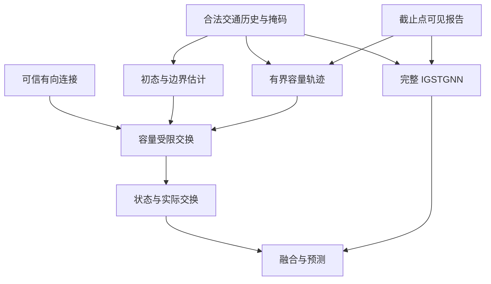

# 有限观测下事故条件容量受限传播与 IGSTGNN 全网预测研究计划

版本：V2
日期：2026年10月9日
研究对象：Contra Costa 全部496个主线站
阶段：研究设计与最小闭环开发，尚无新版真实数据收益结论

**2026-10-10方向修订：** 本版记录已执行的“保留原ICSF/TIID、增加容量传播分支”协议，继续用于解释既有M4结果。用户要求回到改进IGSTGNN自身的事故模块；结合[既有消融复盘](igstgnn_internal_incident_ablation_review_20261010.md)，下一轮优先设计内部事故注入/传播接口与原模块的直接对照。本版第2项等约定不自动继承为新内部模块设计；新方案另行冻结，不追溯修改旧实验身份。事故信息—有效通行性—传播的研究目标及全部496站主任务保留。

## 1 研究定位与主要决策

本研究检验：仅使用预测截止时点之前可获得的事故报告、交通历史和道路资料，通过低维有效容量扰动调制空间递推，能否为完整 IGSTGNN 提供超过同输入普通神经分支的稳定预测收益。

全网主分支采用**有界潜状态与容量受限的有向交换**。其中“有效容量”专指模型允许的最大潜状态交换率；在未取得物理尺度和观测映射证据时，不解释为真实道路容量。具备可信单位、直接连接、边界和观测映射的局部区段，另用 CTM 进行交通动力学验证。两部分分别承担全网预测验证与局部物理解释任务。

本版固定以下决策：

1. 正式预测和评价范围保留全部496站，沿用原冻结时间划分。主分支的有效范围单独记录，不以原主干回退计入机制覆盖。
2. 新增事故信息仅经容量轨迹进入主分支，不直接进入初态、边界、发送接收率或融合特征。原 IGSTGNN 已有事故路径保持在全部对照中。
3. 用同一有向边交换量更新上下游；所有入口、出口和匝道交换进入统一预算，不另设任意逐节点残差源。
4. 将事故位置关联、算子资格、观测缺失分为不同掩码。事故位置之外的有效节点可以接收传播影响。
5. 主实验必做“受限结构或普通结构 × 新增事故条件开或关”的2×2对照，另含完整基线与局部递推对照。
6. 先验证数值、信息路径和小预算真实数据闭环，再决定是否扩大。正式 test 在模型和评价协议冻结后使用。
7. 不修改既有 PHYSICAL_CONTRACT_REQUIRED 状态。无量纲主模型与局部物理 CTM 使用各自的数据资格，不能通过改名或切换标志宣称物理条件已经满足。

### 1.1 拟验证假设

| 假设 | 主比较或证据 | 不支持时的处理 |
|---|---|---|
| H结构 受限交换具有额外预测价值 | P1 对 N1 | 保留新增分支结果，停止宣称受限结构优于普通结构 |
| H报告 新增报告对受限分支有增量价值 | P1 对 P0 | 接受历史观测可能已提供足够信息，不强行解释报告作用 |
| H空间 跨站递推优于局部演化 | P1 对 L1 | 收窄空间传播贡献，比较局部分支的成本与性能 |
| H广度 主架构共同输入覆盖大部分路段 | 联合资格及分层评价 | 补足共同前提或修订架构，不能用回退或共享假设代替 |
| H机制 模型确实通过容量限制改变状态 | 限制项占比、容量敏感性、路径干预 | 排查路径失活；仍无作用时承认该路径未提供有效机制 |
| H物理 局部模型与交通观测一致 | 合格区段的 CTM 与观测验证 | 保留潜状态预测研究，限制道路容量和车辆积累解释 |

拟验证贡献是有限信息条件下的建模、受限信息路径和有辨别力的实证结果。容量真值恢复、事故处置过程重建、事故因果效应和全网车辆守恒均不作为当前默认结论。

## 2 研究范围与已有基础

### 2.1 固定范围

主实验继续覆盖原 Contra Costa 496个主线站及原历史窗口、gap、预测时距和目标变量。上述时间配置与目标定义从现有冻结配置读取，并写入实验清单；不得自行更换为更容易获得收益的设置。

三条40站走廊用于工程开发和局部诊断。223至499米短段仅作为道路匹配、单位及观测映射的锚点，不代表完整传播实验范围。正式评价不因事故支持不足、容量不可辨识或物理资格不足而删去站点。

若原采样是围绕事故展开的条件性样本，主结论首先对应该采样分布。只有另建不依赖事故筛选的连续时间评价，才扩展到自然时间分布下的在线全网表现。

### 2.2 原方案报告的完成项

以下状态继承原方案[0]，用于安排复用；新版接口兼容性和实现状态需在开发中复核。

| 资产或发现 | 原方案报告状态 | V2中的用途 |
|---|---|---|
| 完整 IGSTGNN 与 fixed 对照 | 已有冻结对照及历史结果 | 复现原研究起点并建立成对比较 |
| H1有效容量与点队列 | 已实现并通过合成检查 | 局部基线、融合与时间聚合经验 |
| 无匝道 CTM 内核 | 已有数值测试 | 合格局部区段的物理参照 |
| 全候选历史包 | 9943事件、496站，旧包重合历史一致 | 复用历史输入，核对事件实体和评价重复键 |
| 直接事故训练支持 | 230站、6/14方向组 | 预先定义支持分层，不等同于输入覆盖 |
| 观测诊断 | 169站低速高占有率代理不足100槽；4对源序列完全重复 | 识别信息不足与来源问题，保留统一评价范围 |
| M2.1共享状态与M2.2有界轨迹 | 工程实现及26项测试通过，所述比较模块各1540参数 | 经适配核验后复用，不推定新分支也有相同参数量 |
| 空间分支融合及真实训练 | 尚未完成 | 本版的主要新增工作 |

低速高占有率代理只用于预先定义诊断分组，不能认证或否定某站真实容量可辨识性。9943个候选“事件”也不能直接作为独立统计样本数。

## 3 数据资格与全网共同适用性

### 3.1 主分支的共同必需输入

| 必需项 | 最低资格 | 不满足时的处理 |
|---|---|---|
| 交通历史与时间轴 | 明确三通道含义、聚合方式、采样间隔、截止点和缺失处理 | 暂停该来源进入确认性实验，追查字段或预处理 |
| 观测来源 | 站点与源实体对应关系可信；区分已知原始观测和插补状态 | 共源序列统一标记；未知来源不能算联合合格 |
| 有向直接连接 | 由路线、行驶方向、站序或独立道路资料支持 | 未知连接切为开放边界，不用相关性补造交通交换边 |
| 截止时点可用信息 | 交通输入不由gap、Y或更晚目标信息派生；报告可用时间或条件性假设明确 | 已知目标信息泄漏须重建输入；来源不明时仅作探索，不计确认性资格 |
| 报告关联 | 已有报告可按方向与道路位置关联；无报告可显式编码 | 不将无报告视为已证实无事故；不强制每站有训练事故 |
| 开放边界位置 | 明确连通段端点、已知匝道或连接缺口 | 仅在这些位置允许共享边界预测，不给每站添加源汇 |

全网潜状态主模型不以逐车道封闭数、实际清除时间、真实密度、真实容量、逐匝道流量或真实队列为共同前提。真实物理单位和完整交换映射仍是局部 CTM 的前提。

历史输入可以按训练期统计量归一化；逐站归一化流量不直接进入潜状态交换平衡式。传播使用第5节定义的统一潜单位。

### 3.2 联合资格表

每站及必要连接记录以下字段：

- 节点和源实体标识、路线、方向组、重复源关系。
- 各通道语义、时间聚合、已知单位、源插补依据。
- 合法历史可用比例和允许的缺失处理方式。
- 直接连接、道路依据、开放边界及连接不确定性。
- 输入资格、潜算子资格、局部 CTM 资格，分别编码。
- 训练及验证事故支持，低速高占有率代理分组。
- 资格尚未成立的原因和待完成任务。

**建议的项目验收门槛**为：至少80%的站点，即至少397/496站，同时满足共同输入、来源与时点资格以及有效传播结构资格。计数采用这些条件的交集。该数值是本版将“大部分”操作化的设计门槛，不是已达成结果，也不是交通理论常数。

同时要求：

1. 逐一报告14个方向组的联合覆盖，不允许某方向完全没有有效算子时仍宣称该方向的传播机制已覆盖。
2. 计入传播覆盖的节点须属于经核验的非平凡连续结构。以至少三个相邻且对应不同已核验物理观测实体的主线节点构成的有向路径作为初版计数规则；共源别名不能凑足路径，单节点回退和只用于量纲核验的短站对不计入该传播覆盖。
3. 每个计入节点默认须在至少90%的预先规定评价截止点满足运行资格；这是动态覆盖的设计门槛，在开发阶段一次冻结。按节点以及“节点乘预测截止点”分别报告覆盖，不能只挑选最好时刻。
4. 原主干输出、位置核可计算和预期共享迁移均不计入联合资格。
5. 输入与连接合格的节点正常使用共享参数。是否出现非零事故增量，不作为资格标准；低需求时零响应可能合理。

门槛未通过时，H广度尚未成立。可以继续开发和局部研究，但不能把其结果当作原全网目标已完成。

### 3.3 时点可用性与来源核验

每个样本保存预测截止点、X区间、gap区间、Y区间、报告首次可用时间、字段版本、数据划分及预处理版本。报告发生时间、首次发布或录入时间、最后更新时刻分开记录；实际事故起点未知时不补造。

优先只使用已核实的报告年龄与道路位置。Type、DESCRIPTION等字段须有截止时点版本证据后才能加入。最终 duration、未来清除时间、未来封道更新和未来边界观测不得成为推理输入。

独立X包不自动满足在线资格。需核查源插补是否使用未来时刻、全日资料或事后修订信息。离线条件性协议不豁免输入与目标的信息隔离：已知使用本样本gap、Y或更晚信息形成的源插补，不进入确认性预测输入，须以合法历史重建，或仅作为明确标注的非因果敏感性设置。无法核实的来源可用于工程及探索性试跑，但其资格尚未闭合，不计入确认性联合覆盖。

交通输入已完成目标隔离，但报告首次发布时刻只能在明确假设下重建时，可开展限定报告可用条件的离线研究，并披露该假设；不能由此声称真实在线资格。使用事后字段推断当时报告内容不属于允许的条件性假设。

4对完全重复源序列要追查到物理检测实体、聚合和填补规则。确认共源后保留所有原评价节点，但在统计和机制证据中处理其依赖；没有依据时不删除、不当作独立传播观测。

## 4 数据接口与信息路径

以下为P1的信息路径。图中的报告只经容量轨迹进入新增传播分支；原主干的既有事故路径独立保留。

### 4.1 统一接口

设批量大小为B，历史长度为T，节点数为N=496，预测步数为H，主分支有效内部边数为E。

| 输入或输出 | 含义 |
|---|---|
| Htraffic，B乘T乘N乘3 | 截止点之前的三通道交通历史 |
| Mobs，同历史形状 | 原始有效观测掩码；未知源插补另有状态，不冒充观测 |
| Road 与 Edge | 道路静态属性、已核验的有向边及开放边界 |
| Reports | 截止点可见且完成实体去重的报告集合 |
| Aincident，按报告与边索引 | 报告对容量位置的直接关联 |
| Voperator，按节点与边索引 | 潜算子资格 |
| InternalTimes | 覆盖gap及整个预测区间的内部子步时刻 |
| Xstate，B乘K乘N乘d | 有界潜状态轨迹 |
| Fedge，B乘K乘E乘d | 供上下游共同使用的实际交换率 |
| Cedge 与 LimitFlags | 容量轨迹和限制项诊断，仅用于机制检查 |
| Zfusion，B乘H乘N乘4d | 对齐后的状态、入流、出流与状态变化 |

初版潜状态维度d=4。第5节用一个通道说明公式，其余通道逐分量应用同一规则；事故衰减轨迹在这些通道间共享。不同通道不解释为真实车道、车型或物理车辆存量。

每个潜通道分别计算发送、接收、出价、接收缩放和实际交换，不跨通道合并接收预算。四个时间控制系数不带潜通道索引，生成共享的a，即 \(c_{e,\ell}(u)=\bar c_{e,\ell}[1-a_e(u)]\)。收支恒等式对每个潜通道分别成立。

### 4.2 三类掩码

Aincident仅限制报告直接改变哪些边的容量。Voperator确定哪些节点和边可以执行主算子。Mobs描述历史观测可用性。三者不得复用同一布尔变量。

无直接事故关联的上游节点仍参与递推和融合。只有算子资格不成立的节点，才允许将新增直接融合增量设为零，并单独披露覆盖缺口。

### 4.3 限制新增报告的旁路

初态、边界、基础交换参数均由交通历史、观测掩码和道路资料确定。公共历史编码必须取自事故融合之前，或采用各新增分支一致的独立历史编码器。

新增分支送给融合头的特征只含实际递推后的状态、入流、出流和状态变化。首版不直接拼接容量轨迹、扰动幅度、M2隐藏表示或新增报告embedding，确保新增报告的预测作用必须经过受限交换和状态演化。

原 IGSTGNN 的既有事故路径仍按原设计运行，其作用由全部对照共同保留。

## 5 全网主分支的确定数学形式

本节规定V2的参考算子。它是一项待实现和验证的新设计，不代表既有M2模块已经实现下述全部关系。

### 5.1 有界初态与统一潜单位

对每个有效节点和潜通道：

\[
x_i^0=\sigma\!\left(E_\theta(H_{\le t_0},M_{\rm obs},R)_i\right),
\qquad x_i^k\in[0,1].
\]

各节点采用相同的抽象储量刻度。这个刻度由模型定义，不能换称车辆数或密度；不同道路的真实长度、车道数与储量差异并未因此消失。

初态只编码截止点之前的信息。若存在gap，必须从截止点开始递推穿过gap，再输出目标时刻的状态；不在gap终点重新使用未知观测初始化。

### 5.2 发送预算与接收预算

\[
D_i^k=\alpha_i x_i^k,
\qquad
R_i^k=\beta_i(1-x_i^k).
\]

D表示节点能够发送的潜交换率，R表示剩余潜储量允许的接收率。初版对alpha与beta采用全局或少量道路组共享的有界参数，范围为0.05至2，每个观测间隔作为一个无量纲时间单位。它们不随单个事件自由变化，也不解释为真实自由流速度或拥堵波速。

对节点i全部内部出边及开放出口边，设置：

\[
p_e\ge0,\qquad
\sum_{e\in{\rm Out}(i)}p_e=1.
\]

单一出边取1。分岔的p由静态道路属性和共享参数产生，按出边softmax归一化；没有转向观测时只称发送分配权重，不称真实转向比例。拓扑或开放边界改变时，应重新定义对应预算。

基础潜容量取：

\[
\bar c_e=\kappa_{g(e)}\,p_e\,\alpha_{{\rm src}(e)},
\qquad 0.2\le\kappa_{g(e)}\le1.
\]

kappa按少量道路或边类型分组共享，跨事件不变。alpha、beta、kappa可使用训练损失估计，但禁止逐节点、逐事件、逐时刻各设独立自由值。它们均属于潜模型参数，不据其数值作车辆单位解释。

初版alpha、beta按道路组与潜通道共享，kappa按道路或边类型与潜通道共享；p在潜通道间共享。所有通道遵守相同参数范围，不为单个事件另设参数。

### 5.3 有界容量轨迹及报告条件

参考轨迹采用四个有界控制系数。令u是从预测截止点到gap及预测区间终点的归一化时间，u属于[0,1]：

\[
B_r(u)={3\choose r}u^r(1-u)^{3-r},
\qquad r=0,1,2,3,
\]

\[
a_e(u)=\sum_{r=0}^{3}b_{e,r}B_r(u),
\qquad 0\le b_{e,r}\le a_{\max}=0.95,
\]

\[
c_e(u)=\bar c_e[1-a_e(u)].
\]

由于基函数非负且和为1，轨迹有界且平滑；控制系数无序时允许继续恶化和恢复。四个系数均为零时是零扰动。0.95是初版数值范围选择，不代表真实事故损失上限；完全阻断只在工程场景中作为边界检查。

控制系数由共享小网络输出并映射到允许范围。采用允许精确零的有界投影，初始化在区间内部并检查投影饱和和梯度，不将输出裁剪用于掩盖后续状态更新错误。

报告条件采用明确的同预算接口：

- 由边两端合法历史构造八维摘要U_H，初版为各通道的均值与末次有效值共六维、速度趋势一维、有效观测比例一维。
- 由截止点可见报告构造八维摘要U_E，初版为存在指示、对数报告数、最小平均最大报告年龄共三维、最近站序距离、匹配可信度、聚合关联强度。匹配可信度由冻结的道路匹配规则定义，不补造事故描述字段。
- 同一个系数网络g接收公共历史表示、道路属性与条件摘要，得到历史系数b_H和报告条件系数b_E。
- P0始终使用b_H。
- P1使用 \(b_e=(1-s_e)b_{H,e}+s_e b_{E,e}\)，其中s_e为报告对该边的直接关联强度。

明确规定 \(0\le s_e\le1\)。对每个可见报告j的直接关联 \(w_{ej}\in[0,1]\)，初版采用 \(s_e=1-\prod_j(1-w_{ej})\)；无关联报告时取0。每个报告在候选界面之间的关联权重合计不超过1。报告摘要按冻结的关联权重汇总，多报告不得将s直接累加到1以上；该组合仅是有界关联规则，不代表独立事件概率。

U_H与U_E由固定规则生成，并进入同一个共享参数投影及同一个系数网络g。P1的两次调用共享全部投影和系数网络参数，不另设只在P1生效的报告编码器。这样关闭报告后对应网络仍利用历史摘要；两次调用的额外计算单独披露。若后续需要独立报告编码器，必须重新核定有效参数匹配，不能沿用这里的同预算声明。

这一定义使无关联报告处P1仍有历史驱动的动态容量。报告可以修正历史推断，但c始终不超过基础潜容量。P1与P0的差异属于条件预测差异，不解释为事故相对于无事故的因果容量损失。

报告到边的映射优先定位到同向道路上的事故区间或相邻界面。位置有歧义时可对少量候选界面分配权重，不预先在整条走廊铺设容量下降。并发报告先做实体去重，再形成同一截止点的可见报告集合；采用固定的加权汇总规则，不按不同事故副本遗漏其他已知报告。

**既有M2的复用规则：**先核对其输出含义、节点或边索引、时间原点、报告条件和子步求值能力。满足上述接口时可复用编码与有界输出组件；原脉冲轨迹可保留为同预算敏感性候选。V2主参考采用上述四系数形式，以便方案可独立复现；是否改用既有脉冲族须在开发阶段一次冻结，不能在正式test上挑选。

单调恢复参照使用相同四系数预算，并约束 \(b_0\ge b_1\ge b_2\ge b_3\ge0\)。它是受限模型，不预设单调恢复是真实事故规律。

### 5.4 容量受限出价与共同接收分配

先为内部边及开放出口边计算出价：

\[
z_e^k=\min\!\left(p_eD_{{\rm src}(e)}^k,c_e^k\right).
\]

外部入口提出非负、有上界的需求出价。对每个真实接收节点j，将内部边和外部入口的出价一并求和：

\[
A_j^k=\sum_{e\in{\rm In}(j)}z_e^k,
\]

\[
\lambda_j^k=
\begin{cases}
1,&A_j^k=0,\\
\min(1,R_j^k/A_j^k),&A_j^k>0,
\end{cases}
\]

\[
f_e^k=\lambda_{{\rm dst}(e)}^kz_e^k.
\]

外部汇的接收缩放取1。实现须显式处理零分母，不通过随意加常数改变低流量行为。

该分配保证每个节点全部流出不超过D、全部流入不超过R。在单链上退化为：

\[
f_{i\rightarrow j}^k=\min(D_i^k,c_{i\rightarrow j}^k,R_j^k).
\]

分岔受限后，未使用的发送份额默认不自动改道。这是透明的初版分配假设，不声称恢复真实FIFO、合流优先权或最优通行量。只有独立道路与观测证据支持时再增加复杂节点模型。

### 5.5 开放边界

仅在已标记的入口、出口、匝道或连接缺口位置设置外部源汇。

入口需求由合法历史和道路资料通过共享预测器给出，采用与容量轨迹相同的低维时间参数化并限制在0至2。入口与其他入流共同竞争R预算；出口纳入p和D预算。

不得额外添加逐节点逐子步的无约束源项。未来边界不读真实值，新增报告不直接进入边界预测器。主模型中的潜边界量也不直接解释为真实匝道流量。

边界预测的不确定性通过“恒定历史延续、共享预测、限定幅度扰动”三种开发诊断比较，固定初态和容量再检查边界影响；不把边界敏感性掩盖为容量作用。

### 5.6 同步递推与可保证的性质

\[
x_i^{k+1}
=
x_i^k+h\left(
\sum_{e\in{\rm In}(i)}f_e^k
-
\sum_{e\in{\rm Out}(i)}f_e^k
\right).
\]

全部边从同一个旧状态计算，同一内部边的f同时用于上游流出与下游流入。

若 \(h\alpha_i\le1\) 且 \(h\beta_i\le1\)，由流入流出预算可得：

\[
x_i^{k+1}\ge(1-h\alpha_i)x_i^k\ge0,
\]

\[
x_i^{k+1}\le x_i^k+h\beta_i(1-x_i^k)\le1.
\]

因此初态有界时，精确算术下状态保持在[0,1]，无需事后裁剪。内部边相消还给出：

\[
\sum_i(x_i^{k+1}-x_i^k)
=
h\left(\sum f_{\rm 外部流入}-\sum f_{\rm 外部流出}\right).
\]

这是统一潜单位的收支恒等式。它不证明车辆守恒，也不会自动传递给最终神经预测输出。

默认每个观测间隔使用4个子步，h=1/4，与alpha、beta上界2对应，使 \(h(\alpha_{\max}+\beta_{\max})\le1\)。固定参数将子步数翻倍至8，完成一次数值敏感性检查后冻结。若出现明显步长依赖，先收紧步长或速率范围，不依据验证误差任意挑选传播速度。

## 6 局部 CTM 物理验证

局部 CTM 仅用于单位、连接、观测映射、边界及数值条件均成立的区段。采用CTM的共享界面流量、发送接收约束与车辆守恒思想[1]，但须为实际使用的具体内核单独确定合同。

以无匝道区段为参考：

\[
D_i=v_i n_i/\ell_i,\qquad
R_i=w_i(N_i-n_i)/\ell_i,
\]

\[
f_{i\rightarrow j}=\min(D_i,C_{i\rightarrow j},R_j),
\]

\[
n_i^{k+1}=n_i^k+\delta t
(f_{i-1\rightarrow i}^k-f_{i\rightarrow i+1}^k).
\]

n、N采用车辆数，f、C采用一致的车辆每时间单位，长度、速度和delta t相互一致。若改用密度，更新中显式保留长度因子；若按不同区段储量归一化，保留对应尺度换算。数值步长按所选CTM的稳定条件确定。

含匝道时建立受发送接收预算约束的节点分配及真实交换解释；不在更新后随意加残差。点检测器的速度、流量、占有率与区段状态之间分别定义观测函数及时间聚合。占有率不直接等于密度，任意站点的q/v不直接作为区段密度真值。

局部验证包括：

- 训练期基本图和基础参数的校准依据及范围。
- 合法历史下的初态估计与短时外推。
- 容量扰动前后流量、积累及拥堵传播的响应。
- 观测映射误差、边界敏感性和参数稳定性。
- 与获得相同额外数据的局部普通模型比较。

局部 CTM 结果不作为全网潜模型的物理认证，也不默认生成真实容量标签。未取得独立标签时，CTM反演容量仍是模型估计。

## 7 观测约束 融合与训练

### 7.1 观测约束

主潜分支设置小型共享辅助观测头，只读取递推后的状态与实际交换量，预测与原任务一致的观测目标。该头用于防止潜状态完全脱离观测，不将自由读出称为物理观测映射。

历史一致性通过留出连续历史槽或从较早历史前缀外推到后续历史来检查。同一时刻的观测既完整进入编码器又被原样重建，只能用于工程检查，不能充当机制验证。

较早历史前缀的终点就是该辅助任务的新截止点。交通摘要、报告集合、报告年龄和边界估计均按新截止点重算，不继续使用原完整样本截止点才能获知的信息。

只有共同可用、语义可信的观测才参与辅助损失。N0、N1和L1使用同预算辅助头及同样监督，避免把额外损失带来的收益归给受限结构。

### 7.2 与完整 IGSTGNN 融合

对目标时刻形成：

\[
Z_i^h=[x_i^h,I_i^h,O_i^h,\Delta x_i^h].
\]

入流与出流按观测窗口聚合，状态取合同规定的窗口端点；所有模型使用相同对齐方式。在原预测头前添加零初始化的残差投影。这里的零初始化指残差输出投影，不把编码器、容量网络和所有门控同时置零。

采用同一主干状态、同一输入和确定性推理时，新投影初始化为零应复现原模型输出。随后监测投影、容量网络及传播路径的有效梯度，防止整个分支持续失活。

最终预测继续使用原目标与预测头，默认不满足严格车辆守恒。Voperator不合格处的直接新增增量为零；由此形成的回退不计入主机制覆盖。

### 7.3 损失与优化约束

\[
\mathcal L
=
\mathcal L_{\rm 原任务预测}
+\lambda_{\rm obs}\mathcal L_{\rm 辅助观测}
+\lambda_{\rm curve}\mathcal R_{\rm 容量轨迹}.
\]

主预测损失与原协议一致。辅助观测与主损失先在可比较尺度上归一化，初始lambda_obs取0.1；容量正则采用相邻控制系数二阶差分，初始lambda_curve取0.001。上述权重是开发默认值，真实训练前用共同开发预算核定并冻结。

数值不变区间和潜收支由算子保证，不依赖额外“守恒损失”弥补错误实现。对普通分支不施加受限算子的硬预算，但可采用同级别时间平滑正则，并记录所有额外损失差异。

基础速率、容量基准和分配参数跨事件共享；初态和少量边界轨迹由历史估计。正式版本不同时开放逐站逐时刻容量、需求、初态、源项的独立自由度。

训练默认允许主干与新增分支共同优化，是否采用公共预训练检查点取决于原冻结协议。若使用预训练或分阶段冻结，六组的共同主干起点、额外训练机会和总预算必须一致记录。F指完整原架构对照，不自动表示其权重在所有训练阶段冻结。

## 8 必做实验矩阵

### 8.1 六组核心模型

| 代号 | 新增分支 | 新增报告条件 | 要回答的问题 |
|---|---|---|---|
| F | 无 | 无新增路径 | 是否优于完整原 IGSTGNN |
| N0 | 普通有向图递推 | 关闭，条件槽使用历史摘要 | 一般递推和新增历史信息的价值 |
| N1 | 普通有向图递推 | 开启 | 同输入普通模型能利用多少报告信息 |
| P0 | 本计划的容量受限交换 | 关闭，保留历史驱动动态容量 | 受限结构本身的价值 |
| P1 | 本计划的容量受限交换 | 开启 | 完整主候选 |
| L1 | 容量受限的局部动态状态 | 开启，移除未来跨站耦合 | 空间传播的额外价值 |

全部六组保留原主干事故路径。P0和N0不能读取事故融合后的公共隐状态、报告衍生support、事件特定激活图或事故位置决定的边界。当前图及算子资格由道路与输入证据决定，不能以报告有无决定其可用性。

### 8.2 普通空间递推的具体参照

N0和N1采用与P组相同维度d=4、相同内部子步和有向连接的图门控递推：

\[
m_e^k=\operatorname{MLP}
(x_{{\rm src}(e)}^k,x_{{\rm dst}(e)}^k,c_e^k,R_e,U_e),
\]

\[
\tilde x_i^{k+1}
=
(1-\gamma_i^k)\tilde x_i^k
+\gamma_i^k
\sigma\!\left(W[\tilde x_i^k,\sum_{\rm In}m_e^k,
\sum_{\rm Out}m_e^k,B_i^k]+b\right),
\]

其中gamma为有界门控，B为同样的边界信息。该模型保留状态范围和递推记忆，但不强制共享车辆式收支、发送接收预算及容量最小值限制。

N1可以直接使用与P1相同的合法报告摘要及位置关联；N0以历史摘要替代。让普通模型充分利用同样信息，避免人为削弱普通参照。两者也具有同预算容量时间编码，但该编码在普通转移中作为特征，不施加硬上限。

普通组的融合接口使用状态、入边消息、出边消息和状态变化，维度与P组一致；普通消息不称为物理流量。

### 8.3 局部分支的具体参照

L1保留同样历史、道路、报告、初态编码和动态容量，但未来递推不读取其他节点的未来状态。入流由共同合法历史形成的低维预测替代，局部流出受自身状态和容量限制，仍保持状态范围。

不能简单删掉所有内部入流，使局部单元持续排空，再把其较差结果归因于缺少空间传播。L1的历史输入信息可以与P1相同，所移除的是预测阶段动态状态之间的耦合。替代入流预测器的参数和计算计入完整预算。

### 8.4 公平性和比较顺序

主要结构比较为P1对N1。其次报告P1对F、P1对P0、P1对L1，以及报告增量在两种结构下的差异：

\[
\Delta_{\rm interaction}
=
(L_{P0}-L_{P1})-(L_{N0}-L_{N1}),
\]

这里L为同一评价损失，正值表示新增报告在P结构中带来更大的损失下降。该量是预测交互，不是事故因果效应。

N0、N1、P0、P1、L1统一历史范围、合法报告、道路资料、掩码、边界信息、融合位置、辅助监督和检查点选择规则。统计整个新增系统的可训练参数、有效参数、递推状态维度、训练时间和推理成本，不只统计M2的1540参数。

六组使用同一版本的原任务目标、评价键、有效掩码及公共输入预处理。来源、插补、归一化或目标规则修正后，F按同一修正版数据和成对训练协议重新运行；旧fixed分数仅作历史参照。F保持原有特征集合，不必加入新增分支专用信息，但其原输入和目标不能停留在不同数据版本。公共预训练检查点若使用了后来判定不合格的数据处理，也须重新判断复用资格。

普通参照通过共享网络宽度调整到与P组可比的总有效参数预算。若无法精确匹配，披露差额，并优先给普通模型略充足的预算；不把失活参数计作有效能力。容量轨迹、边界和观测头的额外计算都纳入预算说明。

局部CTM获得的额外物理资料只进入局部配套实验；比较其作用时，普通局部模型获得相同资料。

## 9 数据划分 评价与统计

### 9.1 冻结的样本协议

沿用原时间划分，并保存不可变样本清单。训练目标不得跨进其禁止使用的后续目标范围。归一化、基础参数、图选择、阈值和插补规则按预先许可的数据范围确定。

训练Y仅用于规定的训练损失和参数更新；验证Y用于预先允许的评价、早停、检查点选择和开发阶段模型选择，不参与梯度更新。预测前向接口不得读取未来Y。正式test的目标不参与方案选择；格式和完整性检查的字段、范围及用途须记录，不能利用test分布反复调架构。

同一事故跨越时间边界时披露其数量。连续在线预测中共享合法过去信息可以符合任务定义，但不能同时称为对“从未见过事故”的泛化。若要研究新事故泛化，另在开发范围内设置事件分组诊断，不修改主时间test以获取有利结果。

### 9.2 事件实体与重复评价键

事件包必须明确一个“事件”对应物理事故、报告版本还是采样触发器。对同一截止点，将全部当时可见报告组成统一集合，处理重复报告和并发事故。

标准评价键为：

站点 × 预测截止点 × 预测时距 × 目标变量。

同一个实际预测因多个事故展开而重复出现时，采用预先固定的去重或权重规则。若原协议必须保留事件展开结果，同时报告按标准键去重后的敏感性结果，不把两个评价分布混写。

### 9.3 主终点与分组

优先继承原研究已固定的唯一主变量和主指标。若原配置没有唯一主终点，开发开始时固定一个目标变量，采用其在全部496站与预先规定时距上的站点宏平均MAE；不同单位的目标不直接混合求平均。

所有模型使用相同目标有效掩码。每个站点和时距先计算共同有效目标误差，再按预先规定权重汇总。对无有效目标的情况统一记录，不依据模型结果或物理资格改变分母。

必须报告：

- 全部496站及14个方向组。
- 每个预测时距。
- 主算子联合合格与尚未合格范围。
- 训练期有与无直接事故支持的站点。
- 训练期确定的事故邻域及其他评价时段。
- 169个低速高占有率代理稀少站点。
- 已确认共源或尚待核验的重复来源组。
- 开放边界节点与内部节点。

事故邻域采用报告首次可用后的固定时间范围和同向道路上的固定邻域。空间和时间阈值在开发前根据训练资料及道路资料确定，不根据验证Y寻找“受影响最大的区域”。该邻域是评价规则，不是已知真实影响边界。

若主实验是事故条件采样，应增加可获得的连续时间验证切片，检查一般交通时段的退化；无法取得时明确保留条件性结论。

### 9.4 不确定区间与多次训练

正式实验默认使用5个成对随机种子：11、22、33、44、55。每组保留全部种子的结果，不挑选最好种子作为主结论。

主区间先在相同评价键上对五个种子的成对误差差异求平均，再对保留全网站点相关性的时间块进行2000次成对重采样，重新计算宏平均差异和95%区间。默认以自然日为块；若训练期相关性诊断表明跨日依赖明显，开发阶段改为连续3日或7日块并冻结。

该区间主要描述给定训练结果下的交通样本不确定性。训练随机性另用五个种子的完整差异展示，不能把种子、窗口和站点全部当成独立样本扩充样本量。

事故专项诊断可使用事故簇，但同一事故的站点、窗口及关联报告整体保留；共享大量交通状态的事故合并为更大簇或采用时间块敏感性检查。

P1对N1为唯一首要结构检验。其他比较为预先指定的次要分析；若同时对多个次要比较作显著性主张，使用预先写明的多重比较控制，不仅挑选显著结果。

### 9.5 继续投入与结论门槛

以下是本版建议的项目门槛，不是预期结果：

| 项目 | 初始门槛或规则 |
|---|---|
| 主结构收益 | P1相对N1的主指标改善至少1%，且成对差异95%区间支持改善 |
| 训练稳定性 | 同时展示全部种子；至少4/5同向作为辅助证据 |
| 原研究起点 | 单独报告P1对F，不能用其替代P1对N1 |
| 关键分组退化 | 任一预先指定关键组恶化超过3%时必须分析并收窄广度声明 |
| 机制参与 | 容量限制、梯度及干预响应有实际记录；不规定每事故都必须生效 |
| 广度资格 | 第3节的共同输入与有效传播覆盖门槛成立 |

1%与3%用于项目取舍，可以在未接触正式test的开发阶段基于原误差尺度和用途调整一次，并记录依据；不能为了某个模型刚好通过而倒推门槛。

P1对N1达标只支持H结构。将整套方案称为“改进完整IGSTGNN”，还要求P1对F在同一主终点上达到预先规定的改善条件，初版同样采用至少1%的实际改善与支持改善的成对95%区间。若P1优于N1但未优于F，只能报告新增分支内部的相对结构价值，不能宣称已改善原研究起点。

若区间很宽，结论是证据不足；若仅P1优于F而不优于N1，只能支持新增输入或分支的作用。参数不稳定但预测改善时，保留预测贡献并报告参数不可辨识。

## 10 必要机制检查与敏感性分析

### 10.1 M3必须通过的工程场景

| 场景 | 核验对象 |
|---|---|
| 低需求且容量下降 | 允许流量和状态基本不变，不能强制产生拥堵 |
| 足够需求下单点瓶颈 | 局部积累及上游接收受限按有向连接出现 |
| 瓶颈恢复 | 在边界和需求允许时状态逐步消散 |
| 合流 | 全部入流共用接收预算，不重复使用下游空间 |
| 分岔与出口 | 全部出流共用发送预算，分配假设清楚 |
| 开放入口 | 入口需求也受接收限制，不突破状态范围 |
| 三类掩码 | 事故支持之外能够接收传播；无资格处不计机制覆盖 |
| 子步翻倍 | 固定参数后关键响应不被离散步长主导 |

采用预先固定数值精度的容差检查不变区间和潜收支。容差须按数值精度和累积步数解释，不能以大量事后clip作为通过依据。

### 10.2 训练中必须记录的诊断

在一般图上分别记录容量限制出价、下游接收缩放和发送受限的比例。容量限制的局部判据为 \(c_e<p_eD_{\rm src}\)，接收限制为lambda小于1；并列项用统一容差处理。

记录：

- 容量网络及融合投影的有效梯度。
- 投影饱和、容量贴边和边界贴边比例。
- 分支增量相对于主干预测的幅度。
- 固定初态与边界后，降低容量造成的实际交换和状态变化。
- 不同随机种子下预测与轨迹的差异。
- 历史较短、缺失较多及代理稀少组的表现。

对于单链 \(f=\min(D,C,R)\)，若C高于其余限制项，当前局部梯度可以为零。这是可辨识性边界，不直接等于程序错误，也不能通过强迫每事故产生容量损失来“修复”。

### 10.3 限定数量的补充实验

核心六组完成后，优先只做能解决剩余解释风险的补充：

1. 有界非单调轨迹与同预算单调轨迹。
2. 合法报告延迟一个及两个观测间隔，或按固定比例遮蔽报告。
3. 训练期确定的连续观测缺失增强。
4. 固定同一检查点，关闭新增报告、固定容量轨迹、屏蔽新增分支。
5. 在开发范围内保持方向与道路资格的报告位置错配诊断。

报告延迟和遮蔽形成完整截止点可见集合，不补用原本隐藏的字段。位置错配只检验模型依赖，不充当事故因果识别。没有独立机制标签时，图样、曲线和干预响应不能升级为真实容量恢复证据。

## 11 开发顺序与阶段验收

按依赖关系推进，不把已完成的历史包和H1合成检查重新作为主要交付。下表的V2编号是新版工作安排，执行时映射到现有任务系统。

| 模块 | 主要任务 | 必须交付 | 验收条件 |
|---|---|---|---|
| V2 M1 数据与资格 | 核对496站共同输入、方向连接、源插补、重复实体、原目标与时间配置 | 联合资格表、样本清单、有效图与边界清单 | 明确潜模型与CTM资格；未通过的目标保留阻塞状态 |
| V2 M2 状态与轨迹适配 | 核读并适配既有M2，落实四系数参考轨迹、报告集合与三类掩码 | 状态与容量接口、参数统计、时点约束 | 有界、可为零、支持子步求值，无隐藏报告旁路 |
| V2 M3 有向交换算子 | 实现发送、容量、接收分配及开放边界同步递推 | 状态、实际边交换、限制项日志和必要数值检查 | 不变区间、潜收支、合流预算及瓶颈响应成立 |
| V2 M4 主干融合与对照 | 零初始化融合、辅助头、N0/N1/P0/P1/L1 | 六组可运行配置、共同训练与评估接口 | 关闭新投影时复现原输出；信息与预算差异可解释 |
| V2 M5 开发验证 | 小预算试跑、容量参与诊断、参数与边界敏感性 | 成对开发结果、失败分析、冻结实验协议 | 无信息违规或未解释数值错误；完成一次有针对性的修订 |
| V2 M6 正式实验与论文证据 | 完整预算五种子、最终test、局部CTM配套验证 | 主表、分层表、区间、机制诊断和成本 | 按预注册规则解释正负结果，不以可视化替代比较 |

### 11.1 相对训练预算

令B为原基准可复现的完整训练预算，优先按优化步数、样本暴露量和早停规则定义，同时记录墙钟时间。

- 工程闭环：六组各1个共同种子，约5%至10%的B，只判断接口、数值、前向反向和掩码。
- 开发比较：需要时六组各3个成对种子，约25%至50%的B，用于判断方差、训练行为和剩余风险。
- 正式研究：六组各5个成对种子，统一完整预算，共30个模型训练结果。旧F检查点只有在数据、划分、目标、预算和种子均符合共同协议时才可复用。

小预算排名不能直接替代正式结论。开发阶段最多安排一轮针对明确问题的结构修订；修订后锁定模型、损失、数据、指标、分组和选择规则，再进入正式阶段。新增假设或后续架构应建立新版本，不反复用同一test指导选择。

### 11.2 阶段停止与调整条件

共同输入资格不足时，停止扩大“满足大部分路段”的结论，优先补拓扑和来源依据。只有按第3节排除目标信息污染、明确报告可用假设后，才可保留相应离线条件研究；来源未闭合的数据仅作探索。局部物理资格不足时，暂停该处真实CTM训练和物理解释。

若容量与融合持续失活，先排查初始化、投影饱和、梯度和掩码。排除工程问题后仍无有效增量，应记录当前结构未提供可用价值。若容量参数不稳定但预测改善，继续报告预测结果并收窄参数解释。

若P1未优于N1，不通过增加无关模块掩盖结果；根据开发证据决定报告负结果、采用更简单分支，或提出有明确新假设的下一版本。

## 12 相关工作与贡献界定

| 工作 | 已有内容 | 本研究聚焦的差异 |
|---|---|---|
| Daganzo CTM [1] | 共享界面流量、交通守恒、拥堵传播及事故导致的时变参数 | 有限报告与历史下怎样学习条件化扰动并改善预测 |
| Tang等 [2] | 有范围的交通流参数估计，神经重建与独立CTM一致性 | 事件条件轨迹、未知未来边界和预测截止点条件 |
| KalmanNet [3] | 部分已知动力学中的状态演化与观测信息结合 | 借鉴信息分工，不继承其最优性、监督条件或性能结论 |
| Rizvi等 [4] | PeMS检测器事故检测与CTM容量和位置估计 | 可见报告与历史共同条件化及完整IGSTGNN增量比较 |
| SIS-CTM [5] | 事故影响网络中的容量下降、拥堵状态及传播 | 有限观测下的学习、受限潜状态算子和公平预测实验 |
| Lu等 [6] | 交通状态与队列联合估计、流体队列及可微计算图 | 新增报告经容量限制进入空间预测的具体路径 |

对Tang工作的架构与范围说明依据2023年作者稿：编码器、解码器均为神经网络，CTM是另一个一致性算子；时段内标称容量等参数校准与事故导致的事件内突变不同。作者稿有随拥堵状态切换的容量，不能写成“完全没有时变容量”。

外生事故通行能力损失与拥堵后放行能力下降的capacity drop应区分。本研究的有效容量门可能同时吸收多个因素及模型误差，不将其数值解释为封道比例。

Daganzo允许事故改变容量、神经网络估计交通参数、可微队列或状态估计，都已有先例。论文贡献拟组织为：

1. 明确的信息条件：仅用已到达报告和有限历史、预测未来边界。
2. 明确的结构限制：新增报告须通过容量上限、实际交换和状态演化贡献预测。
3. 可拒绝的实证检验：同输入2×2、空间消融、全网分层、参数参与和代价分析。

全网潜状态模型的成功支持结构先验的预测价值；局部CTM成功支持相应区段内的交通解释。两者不能合并成“已恢复全网真实事故容量”。

## 13 主要风险与处理

| 风险 | 识别方式 | 预先规定的处理 |
|---|---|---|
| 单位、聚合或来源错误 | 联合资格与共源核查 | 暂停相应资格，先修数据解释 |
| 报告或插补存在未来信息 | 字段首见时间与预处理审查 | 排除目标信息污染，建立合法输入；限定报告假设不等于在线资格 |
| 潜状态与真实交通脱节 | 辅助观测外推、局部参照 | 限制物理解释，检查状态及读出 |
| 容量不生效或不可辨识 | 限制项、敏感性、跨种子轨迹 | 不强制每事故降容量，报告弱识别范围 |
| 边界吸收全部变化 | 固定容量后的边界敏感性 | 减少边界自由度并披露剩余不确定性 |
| 位置核预写空间影响 | 单点支持与去耦合比较 | 缩小直接容量作用范围，保留位置不确定性 |
| 预测头绕过传播 | 输入路径审查与检查点干预 | 禁止新增容量或报告特征直接拼入融合 |
| 全网均值掩盖局部退化 | 方向、站点、事故邻域分层 | 收窄适用范围并记录退化 |
| 高度相关样本制造精度假象 | 事件实体、评价去重、时间块 | 保留相关结构计算区间 |
| 模块和调参持续膨胀 | 预算与版本记录 | 只针对已观察问题修订，避免无限搜索 |

滚动截止点会基于新增历史重新估计未来轨迹。不同截止点的估计不自动构成同一事故的真实连续处置记录；跨截止点一致性可作为后续诊断，不作为当前真实过程恢复声明。

封道、处置和队列资料继续作为增强数据定向寻找。它们若取得，可用于独立机制检查；若缺失，不以语言模型补写真值。外部道路数据集只能提供独立验证，不能替代当前Contra Costa缺失的历史记录。

## 14 最近一次服务器任务与完成定义

下一次服务器任务的目标是形成**一套有资格说明的最小传播闭环及公平对照记录**。具体顺序为：

1. 读取原冻结配置，锁定目标变量、历史窗口、gap、预测时距、划分、归一化和基准训练预算。
2. 复用全候选X包，形成496站联合资格、有效有向图、开放边界和重复实体清单。
3. 核读M2接口，将轨迹映射到有效边及内部时刻，落实历史条件与报告条件两种输入。
4. 完成V2 M3同步交换，并输出实际状态、交换、限制项及不变区间检查。
5. 在已通过主模型数据资格的范围完成六组最小工程试跑；正式预测评价接口始终保留496站。
6. 保存配置、数据版本、共同评价键、日志、成本和失败记录，形成是否进入开发比较的明确判断。

本次任务不以再次展示H1合成测试通过作为新增研究进展。若资格暂未成立，合格交付是具体的资格缺口和已完成的新接口检查，不能把“可运行”写成“已全网适用”。

正式论文结果至少应包含：

- 六组模型的主预测表及五种子结果。
- 方向组、支持范围和各时距的分层结果。
- P1对N1的成对区间及实际收益。
- 容量参与、空间耦合与边界敏感性证据。
- 主算子覆盖与局部CTM覆盖的独立说明。
- 训练和推理成本、参数量、数据可用性限制。
- 未获支持的假设和相应结论边界。

## 15 参考文献与依据

[0] 原研究方案。有限观测下的事故—容量—传播 IGSTGNN 改进方案，2026年10月9日。附件文件名：incident_capacity_propagation_design_20261009.md。本文已有资产与数据数量沿用该方案的进度报告；新版数学结构和实验门槛为新增设计。

[1] Daganzo, C. F. (1994). The cell transmission model: A dynamic representation of highway traffic consistent with the hydrodynamic theory. Transportation Research Part B: Methodological. [DOI 10.1016/0191-2615(94)90002-7](https://doi.org/10.1016/0191-2615(94)90002-7)。具体方法核读依据为[1993年前驱报告](https://escholarship.org/content/qt0b6612tk/qt0b6612tk.pdf)的第2、3、6节；报告封面年份与仓储封装页年份区分记录。

[2] Tang, Y., Jin, L., and Ozbay, K. (2024). Physics-Informed Machine Learning for Calibrating Macroscopic Traffic Flow Models. Transportation Science. [DOI 10.1287/trsc.2024.0526](https://doi.org/10.1287/trsc.2024.0526)。具体架构及范围依据[2023年作者稿v1](https://arxiv.org/html/2307.06267v1)第2.1节、第3节及式7至10；不将作者稿细节自动视为已逐式核验的期刊终稿。

[3] Revach, G., et al. (2022). KalmanNet: Neural Network Aided Kalman Filtering for Partially Known Dynamics. IEEE Transactions on Signal Processing. [DOI 10.1109/TSP.2022.3158588](https://doi.org/10.1109/TSP.2022.3158588)，[作者稿官方页面](https://arxiv.org/abs/2107.10043)。本计划仅引用状态演化与观测信息结合的思想范围。

[4] Rizvi, S. M. A., Ahmed, A., and Shen, Y. (2020). Real-Time Incident Detection and Capacity Estimation Using Loop Detector Data. Journal of Advanced Transportation, Article 8857502. [出版社与DOI页面](https://onlinelibrary.wiley.com/doi/abs/10.1155/2020/8857502)。相关工作判断依据出版社摘要，不能据此推定全部实现细节。

[5] Wang, J., Zou, L., Zhao, J., and Wang, X. (2024). Dynamic capacity drop propagation in incident-affected networks: Traffic state modeling with SIS-CTM. Physica A, 637, 129536. [DOI 10.1016/j.physa.2024.129536](https://doi.org/10.1016/j.physa.2024.129536)，[出版社预览](https://www.sciencedirect.com/science/article/pii/S037843712400044X)。相关工作判断依据摘要和预览，未以其完整公式作为本计划的已核实现依据。

[6] Lu, J., Li, C., Wu, X. B., and Zhou, X. S. (2023). Physics-informed neural networks for integrated traffic state and queue profile estimation: A differentiable programming approach on layered computational graphs. Transportation Research Part C: Emerging Technologies, 153, 104224. [DOI 10.1016/j.trc.2023.104224](https://doi.org/10.1016/j.trc.2023.104224)，[作者机构官方记录](https://asu.elsevierpure.com/en/publications/physics-informed-neural-networks-for-integrated-traffic-state-and/)。该工作采用流体队列等模型，不将其描述成与本计划相同的CTM分支。
