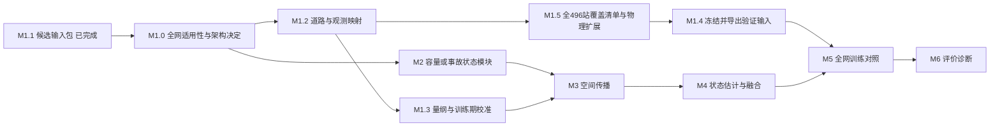

# 事故—容量—传播改进：开发任务与验收

日期：2026-10-09。依据[研究方案](incident_capacity_propagation_design_20261009.md)。目标是改善完整 IGSTGNN 的事故条件预测，且用同输入参照区分新增数据、事故条件和物理结构各自的作用。

按六个模块交付，每次完成一个可检验的小任务。代码、测试、真实数据产物和研究效果分别记状态，不将工程通过写成预测增益。

**最新状态：** 主架构的必需输入应在现有大部分路段上同时具备，核心新增机制也须实际可用。M1.0a/b/c 已完成输入覆盖、事件扩展可行性及[候选X包和观测诊断](incident_candidate_history_20261009.md)：9943候选事件、496站、14方向组，来源核验及旧包重合历史比较通过。可进入 **M2.1 共享相对容量状态模块的工程原型**。严格CTM保留局部参照；具体物理闭合仍需验收，当前不是正式训练或多数道路物理模型已认证。下文M3/M4的直接CTM分解继续作为候选。

## 开发走廊与最终实验范围

2026-10-09 补充：用户询问为何只有三条道路、是否计划使用全路段。原计划写了完整主干及整体指标，但没有明确列出从 40 站扩展到全路网的交付，这是计划缺项。本节和 M1.5 明确补齐，尚未实现全网物理映射。

**正式主实验使用当前 Contra Costa 数据集的全部 496 个主线站和原冻结时间划分。** 当前 40 站是物理分支开发/接口验证样例；不能把它作为最终主实验的全部节点范围，也不能仅报告三条走廊的改善就称为全网改善。3,604 是保留的训练窗口数，40 是当前辅助包站点数，两者维度不同。

源站点表实际覆盖 14 个道路/方向组：I580-E/W 为 12/12 站，I680-N/S 为 74/81，I80-E/W 为 38/47，SR160-N/S 各 1，SR24-E/W 各 21，SR242-N/S 为 9/8，SR4-E/W 为 85/86。三条当前走廊只取 SR4-W 的 16/86 站、SR24-W 的 15/21 站，以及 SR242-N 的 9/9 站；没有包括它们的全部反向道路。

三条道路沿用此前预筛：217 对通过元数据预筛的候选中，保留训练报告支持大于零者，按支持窗口降序、有效比例降序、里程差和稳定标识排序，每条编号道路取一对，再取前三条；随后每端扩展 3 个源 postmile 单位。该选择没有使用预测结果，但偏向报告支持较多且通过局部元数据预筛的区段，**不构成全网代表性证据**。已取得的静态匹配资料可以复用，降低第一轮开发成本。

范围按以下三个层次执行：

1. **开发阶段：** 先做 M1.0 全网适用性检查，再用 40 站验证选定的数据流、容量模块和传播计算；原 496 站数据及基线保持完整。
2. **正式实验前扩展：** M1.5 对全 496 站/14 个方向组建立道路、连接和观测覆盖清单，按统一证据规则扩展可用物理走廊，包含其他道路及反方向。不得依据验证收益只保留“有效道路”。
3. **正式主实验：** 完整模型在 496 站上训练和预测，另报物理指导/直接递推的适用范围及分组结果。具体采用局部直接物理分支还是全网共享事故状态模块加适用位置物理指导，由 M1.0 后的设计决定。“不适用处保留主干”仅保证输出完整，不能替代全网改进模块的适用性论证。

全量使用交通数据与全量应用硬物理约束是两个验收项。SR160 每方向只有一个现有主线站，不能凭空构成相邻站走廊；此类数据仍参与全网预测，但需报告物理分支不覆盖的原因。车道/道路属性不足也不能通过虚构连接补齐覆盖率。设计须支持可变走廊长度和统一模块接口，不能把这三条道路或 40 个站号硬编码成模型适用范围。

## 模块及依赖

| 模块 | 负责内容 | 交付物 | 依赖与当前状态 |
|---|---|---|---|
| M1 走廊数据与道路映射 | 全网适用性、历史三通道、事故关联、物理连接及观测含义 | 架构依赖检查、开发输入包、496 站覆盖清单、冻结的 train/val 适配 | **M1.0a/b/c与M1.1已完成**；真实连接/绝对量纲及新增目标/验证适配仍未完成 |
| M2 事故容量估计 | 由报告和历史估计有界有效容量扰动 | 容量模块、条件开关、低维轨迹参照 | **M2.1当前下一任务**；相对数值接口已具备，真实容量解释仍依赖证据 |
| M3 物理空间传播 | 供需限制、共享界面流量、车辆积累和边界交换 | 可微走廊递推、守恒/回溢数值检查 | 已有无匝道单步内核；空间接入依赖 M1.2/1.3、M2 |
| M4 状态估计与主干融合 | 从部分观测估计初始状态、对齐站点/时距、接入 IGSTGNN | 历史编码器、观测映射、零初始化融合 | 依赖 M1 接口与 M2/M3；尚未完成 |
| M5 训练与对照 | 相同输入、预算、切分下训练、续跑及记录 | 配对训练器、496 站主实验、一次 Bash 入口、结果清单 | 正式实验依赖 M1.5/M1.4/M4；不重复 H1 空跑 |
| M6 评价与诊断 | 预测增量、事故路径作用、传播价值及参数稳定性 | 同端点评估、消融、机制诊断报告 | 依赖 M5；最终 test 不用于开发 |

新增 M1.5 保留原任务编号，正式实验前先完成它，再由 M1.4 按冻结范围导出验证输入并接入 M5。小范围工程运行不能作为最终主实验。M1.0c已完成，可用共同输入开展M2.1；已有H1合成接口可以复用，真实物理训练须满足对应方程的输入条件。任务依赖允许交错推进，不要求启动独立代理或服务器作业。

## 小任务和验收

### M1：数据与道路

- **M1.0a 已完成：全网输入联合覆盖审查。** 全 496 站三通道历史在同站同时间有限且非负，基本元数据和学习图输入交集覆盖完整；不代表单位、物理连接或源观测质量已认证。事故直接训练支持只有 230 站、6/14 个方向组。3,604 条身份及空间关联重放全部一致，事件仅在 SR4/SR24/SR242，限制早于 40 站过滤。交付 496 站/14 方向组清单与哈希，7 项测试和真实审查通过。
- **M1.0b 已完成：事故扩展可行性及架构需求。** SR160发布元数据因三支持点规则未恢复身份；I80/I680/I580在发布空间关联中已缺席，未取得原构建代码解释具体原因。源表按1/3/5km及同路同向/里程核对，得到9943/11450/12496条训练期候选，均涵盖14方向组。3968站月训练缓存记录哈希全部通过，无需重新下载这些交通文件。交付需求与量纲表，4测试及实际审查通过。决定优先验证相对容量状态及方向传播，严格CTM作为局部参照，尚未把任何未认证关系冻结成物理主模型。
- **M1.0c 已完成：全网候选 X 与观测一致性。** 固定1km等元数据规则后得到9943事件，逻辑X为`[9943,12,496,3]`，按49468个唯一历史时刻紧凑存储。496站数值和报告公式关联覆盖完整；3465重合事件的61871040历史数值与旧包完全相等。前期拟合/后期检查的`q≈αov`站点中位对称误差5.29%，属于观测诊断而非预测收益。169站低速高占有率代理槽少于100；4对站点源月缓存完全重复，已标记，不能当独立物理证据。9测试、真实构建和独立验证通过；未读新Y、未改变原包、物理容量仍未认证。
- **M1.1 已完成：候选多站历史输入包。** 固定三条已有道路锚点，各向两端扩展 3 个源 postmile 单位，保留落在范围内的当前主线站，不用预测结果挑站。导出全部 3,604 个训练窗口的原始三通道、数值可用掩码、报告位置/年龄、站序映射及已知匝道标记。拒绝身份错位、重叠值冲突、非训练时间及损坏文件。14 项测试和本地真实 Bash 流程通过，见[产物与运行说明](incident_corridor_pack_20261009.md)。
- **M1.2 在适用性决定之后：候选站序转为有证据的道路/观测映射。** 按 M1.0 确定的需要，对开发站点进行官方道路匹配，核对方向与相邻连接；明确检测器位于 cell 内部还是界面，处理 SR242 的 401393/401401 同里程站，标记匝道边界。交付物分别列出可用连接、暂不能使用的连接及理由，不能直接把 postmile 差当 cell 长度，也不要求为凑走廊长度强行连接。
- **M1.3：量纲与校准约定。** 核对实际采用通道的单位、聚合与源预处理；定义训练期基准容量、速度参数和状态范围的校准方法及敏感性范围。容量不是直接取最大流量；不要求取得队列真值或所有封道更新。少量例外允许披露未覆盖；若缩小范围导致核心机制只适用于少数道路，应返回 M1.0b 修改架构需求，不能用任意自由源项替代物理定义。
- **M1.4：冻结适配后输出验证输入。** 复用训练期确定的站序、道路映射、参数和填补/标准化规则；不根据验证目标改路段、换参数或调支持阈值。测试目标继续封存。
- **M1.5 新增，正式实验前必做：全路网覆盖清单与物理分支扩展。** 对全部 496 主线站/14 个方向组登记道路映射、候选连接、长度/边界证据及观测可用性，逐项保留纳入或未纳入原因；按与开发走廊一致的规则扩展其他道路和反向道路。输出完整站点轴、物理分支支持掩码、可变长度走廊映射与覆盖统计；按训练范围/独立道路资料确定，不看验证预测收益。要求所有 496 站都被清单解释、主干输入输出不丢站；不要求给每个站伪造物理连接。之后完成 M1.4 的全网适配冻结。

### M2：事故容量（当前优先做共享相对形式）

- **M2.1 当前下一任务：共享相对容量状态接口与受限工程原型。** 使用M1.0c共同历史、掩码、报告/关联和固定训练参考尺度，先写清状态—观测—容量限制的对应关系，再实现低维有界扰动及显式新增事故条件开关。优先共享参数，不因169站缺少低速代理样本而逐站自由标定真实容量；p95参考不称容量。保留原IGSTGNN事故路径及496站轴，同输入普通分支作为参照。先验证零扰动、低需求、容量降低/恢复和下游受限等合成情景、梯度及保存恢复，不从候选X包读取未来或宣称物理认证。`q≈αov`诊断只作观测假设，不自动变成密度/守恒方程。
- **M2.2：有界的可变化轨迹。** 在写代码前固定一个小规模、非强制单调的轨迹方案；与单调恢复版本共享其余部分。检查无新增事故条件时的基线、有限数值、扰动空间支持和时间平滑，不预设事故必然降低可观测流量。
- **M2.3：参数稳定性与可辨识性。** 检查基准容量、事件扰动和需求是否互相抵消，比较跨种子参数与预测稳定性。参数只是有效解释，预测提升不能自动认证真实封道或恢复时刻。

### M3：空间传播

- **M3.1：从单步内核到完整走廊 rollout。** 复用 `src/models/traffic_physics.py`；校验长度、参数范围、CFL 和同一界面两侧流量相等，推进完整缺口及预测时段并作时间聚合。
- **M3.2：边界交换。** 按 M1.2 的边界类型分别处理可信观测历史和有界预测；保持低维、共享的缺测边界模型。无依据区段不纳入严格守恒声明。
- **M3.3：机制数值验收。** 合成容量降低、恢复、上游低需求及下游受阻场景；检查积累、回溢、非负、储存边界和梯度。相邻 cell 的接口守恒不等于最终神经读出守恒。

### M4：状态与融合

- **M4.1：部分观测到初始状态。** 依据 M1.2/1.3 的观测映射，使用历史三通道和掩码估计区段状态。占有率不直接等于密度；报告不能回填成其发布之前已可用的观测。
- **M4.2：与完整 fixed 融合。** 复用原主干，在明确的站点/预测时距上注入零初始化物理特征；保持原 ICSF/TIID 事故路径。新增容量条件关闭只影响新增路径。
- **M4.3：联合工程验收。** 相同共同权重下初始预测一致、训练后分支有梯度、无支持处直接增量为零、没有未来输入；验证批量、设备、保存加载与恢复。

### M5：训练

- **M5.1：同输入普通空间递推参照。** 输入、输出位置、时间步和可比记忆保持一致；披露实际参数量。不能用额外速度/占有率只喂物理臂。
- **M5.2：小规模配对工程运行。** 检查两个模型的样本顺序、共同初始化、更新数、训练预算、指标轴和存档；短跑结果仅判断是否能运行。
- **M5.3：冻结协议后的 496 站正式开发集实验。** 完成 M1.5/M1.4 后，在原完整训练/验证窗口及 496 站上比较 fixed、普通递推、物理分支新增事故条件开/关，并按实验问题安排空间/局部队列对照。各新增分支使用相同辅助信息与支持掩码，避免混淆信息覆盖和物理结构增益；不得只用 40 站误差替代主结果。Bash 不包含版本控制命令，服务器由用户执行。

### M6：评价

- **M6.1：同端点预测比较。** 首报原协议全部 496 站的整体指标，再报物理覆盖/未覆盖节点、各道路与时距、成对种子差异；另列站点/事件支持覆盖分母及缺测规则。新增道路上的结果与开发三条走廊分开显示；全网联合训练后的分道路结果不冒称未见道路泛化实验。
- **M6.2：模块作用诊断。** 同 checkpoint 干预、事故位置负对照、空间耦合消融、容量/边界敏感性。诊断支持模型依赖解释，不当作真实事故因果识别。
- **M6.3：是否保留模块。** 优于完整 fixed 且相同信息普通分支不能解释全部收益时，才讨论候选机制的贡献；失败时根据对照定位问题，避免继续堆叠模块。

## 跨模块接口约定

| 接口 | 轴/含义 | 当前可用性 |
|---|---|---|
| 历史输入 | `[B,12,K,3]`，源顺序 flow/occupancy/speed；布尔数值可用掩码同形 | M1.1 已有；单位和原始插补情况未认证 |
| 报告输入 | `[B,K,3]` 原 `report_location_v1` 关联，报告年龄 `[B]`；时刻按 t0 | M1.1 已有，保留原离线条件性假设 |
| 站点映射 | 原 496 站轴 ↔ 辅助包站点轴 ↔ 单条走廊有序轴 | M1.1 当前 40 站；M1.5 扩展，支持可变节点数 |
| 物理网格 | 有向直接连接、正长度、检测器观测位置、边界交换类型 | M1.2 交付；当前 `physical_length_km=null` |
| 容量 | `[B,T_internal,C]`，有明确车辆/小时单位，C 表示物理区段数 | M2 交付，C 不预设等于检测器数 K |
| 状态/界面流 | `[B,T_internal+1,C]` 状态，界面流另按网格边索引 | M3/M4 交付；初始状态先于第一个递推步 |
| 主干融合 | `[B,12,K,H]` 对齐隐藏特征，映射回完整网络 | M4 交付；H 沿用实际主干隐藏维度 |

内部时间步须由真实长度/CFL 决定，不硬编码所有走廊统一 1 分钟。预测仍保持原 12 步历史、10 分钟缺口、12 个 5 分钟目标区间；没有增添新的目标或改变训练切分。

## 本轮完成与下一次开始位置

已完成 M1.1及M1.0a/b/c。新的`run_incident_candidate_history.sh`用于全496站候选X，原`run_incident_corridors.sh`仍输出40站包，两者用途不同。真实新包和独立验证已在本地完成，本轮无需服务器重复运行。下一次进入 **M2.1共享相对容量状态的工程原型**；主模型未改、正式训练未开始，新增目标/验证包及实际物理依据仍须后续交付。
