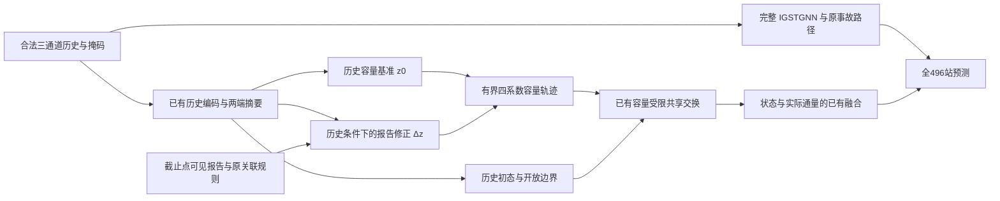

# 下一阶段设计：历史条件下的事故报告容量修正

日期：2026-10-10。状态：**M4.5分析器已实现并通过本地工程检查，待服务器实际epoch9产物分析；M4.6模型和M4.7训练入口尚未实现**。本次纳入用户建议的单条件槽、系数空间混合及梯度归因澄清。

目标继续是“事故报告 → 有效容量变化 → 交通影响传播 → 改进完整IGSTGNN预测”。本阶段针对一次已观察到的问题修订容量条件接口，继承[V2研究计划](incident_capacity_propagation_research_plan_v2_20261009.md)与[V2.1约定](incident_capacity_propagation_v21_contract.md)。本文件仅覆盖下一轮开发；不能替代正式六组、五种子和数据资格要求。

## 1. 依据与尚未解决的问题

服务器P1最佳epoch9的完整917条验证ON/OFF/ON已经通过。OFF只关闭新增报告的容量条件，原IGSTGNN的事故输入保留。用户回传的控制台结果归档于[服务器证据摘录](incident_capacity_report_probe_server_20261010.json)，不是本地独立重跑的服务器结果。

| 范围 | OFF MAE − ON MAE | 预测最大绝对变化 |
|---|---:|---:|
| 全496站 | 0.0000096530 | 2.23654 |
| 报告直接关联节点 | 0.0001948387 | 2.23654 |
| 潜在传播范围内其他节点 | 0.0000478636 | 1.10431 |
| 没有匹配报告的样本 | 0 | 0 |

正值表示ON较好。887/917条样本有匹配报告，直接关联的样本×节点位置占4561/454832，约1.003%。报告关联边上的容量和实际交换均发生变化；当前路径已连通，但平均净误差改善没有实际量级上的说服力。潜在传播范围是弱连通结构包络，不是观测到的事故影响范围。

尚不能区分：响应只集中于少量位置；正负预测收益抵消；报告信息与历史及原事故路径重叠；容量条件或读出训练没有提取有效增量。当前汇总结果不能证明其中任何一个解释。不能通过强制容量下降、放大报告权重或扩大匹配范围来制造响应。

代码中的旧接口是：

```text
b_H = clip(g(common_history, U_H), 0, 0.95)
b_E = clip(g(common_history, U_E), 0, 0.95)
b   = b_H + association * (b_E - b_H)
```

`common_history`已经包含两端隐藏状态和两端历史摘要，因此旧实现并未丢掉历史。可检验的改动是显式分开历史基准与条件修正，避免同一个输出头同时承担基础容量与报告差异的学习；同时用匹配对照控制新增参数和输出映射的改变。残差形式本身不保证利用到统计上独有的信息，也不自动构成新颖性。

## 2. 三个小任务及交付顺序

| 小任务 | 要回答的问题 | 计划交付 | 开始训练的条件 |
|---|---|---|---|
| M4.5 已有结果分解 | 响应少，还是改善与恶化抵消？哪些输入分组存在规律？ | 只读后处理脚本、配对分解表、触发事件/截止点汇总 | 先完成可重算和身份核对 |
| M4.6 容量修正接口 | 显式保留历史基准能否更好利用报告？ | 新模块、同参数历史对照、接口与梯度检查 | 工程验收通过，冻结新协议 |
| M4.7 两组开发比较 | 新报告是否超过同参数历史模型？ | 两组各10完整epoch、最佳及同轮结果、最佳检查点ON/OFF诊断 | 不以首轮计时或单个样本作效果结论 |

M4.5先用现有产物完成，不新增训练和推理；其结果用于解释和决定是否值得执行已定义的M4.6候选，不据收益反向挑选道路、样本或评价区域。若诊断支持其他修订，另记设计变更和原因，不同时实现多个候选。

## 3. M4.5：把近零净收益拆开

### 3.1 输入及分组能力

只读服务器成功会话`report_capacity_probe_20261010_195655_424b3a`中的`report.json`、`replay.json`、`samples.csv`、`paired_predictions.npz`、`pathway_curves.npz`、`invocation.json`及检查点审计。按原invocation定位候选图、站点与道路元数据，核对原哈希；从边和报告关联重建直接节点与弱连通分量包络。验证样本顺序、站点轴、目标掩码、目标窗口与原摘要一致；保存输入哈希。最终会话路径必须由参数传入，不硬编码用户目录。

当前CSV有触发`incident_id`、`t0`、报告数量及最年轻匹配报告年龄。按触发事件和截止点分别汇总；这不是逐条匹配报告归因，并发报告共享作用时不能全部归给触发事故。若需要每条报告实体分析，必须从已有报告适配资料合法重建实体清单并单独记来源；不能从汇总数组猜测。

主表沿用全部917行等权与原horizon-macro pooled MAE。触发事件/唯一截止点逆行数加权只作敏感性表，不替换主指标；存在不同缺测数时，它不等于先算每组MAE再等权。不同原事故输入的同截止点预测不能简单合并成同一个预测。没有可信实体对应时，保留窗口级描述并明确独立事件数未知。

### 3.2 精确误差分解

对同一个有效位置定义：

\[
d_{s,h,n}=|\hat y^{OFF}_{s,h,n}-y_{s,h,n}|-|\hat y^{ON}_{s,h,n}-y_{s,h,n}|.
\]

令预定义区域在时距h的有效目标数为C_h。使用同一个区域掩码与同一分母计算：

\[
G^+=\frac1H\sum_h\frac{\sum\max(d,0)}{C_h},\qquad
G^-=\frac1H\sum_h\frac{\sum\max(-d,0)}{C_h},\qquad
G=G^+-G^-.
\]

必须重算得到报告中的`OFF_MAE_minus_ON_MAE`。不可将每事件MAE简单相加来声称复现全局指标。空区域的区域MAE与区域归一化收益G为null；任一时距缺少有效目标时，区域宏平均保持与旧评价器一致的不可用规则。

另设全网时距有效数C_all,h，区域全网贡献为`K_A=mean_h(sum_A(d)/C_all,h)`。固定四个互斥穷尽区域：直接关联节点、同包络的其他节点、有报告支持样本的包络外节点、无报告支持样本的全部节点。逐时距及宏平均验证`sum_A K_A=G_all`。全网分母有效时空区域K为0；不能把各区域G或道路/年龄交叉表再相加。

同时输出预测绝对变化的时距宏平均、全有效位置池化均值、未加权分位数、最大值及超过`1e-4/1e-3/1e-2/0.1/1`的比例。旧探针的`prediction_abs_change_mean`是池化均值，不能在时距缺测数不同时替代宏平均上界。阈值是原目标数值尺度上的描述，不代表显著性或真实交通单位。抵消率为`1-abs(G)/(G_plus+G_minus)`，正负总和为0时返回null。验证逐位置`abs(d)<=abs(OFF-ON)`、逐时距及宏平均的更强上界`G_plus+G_minus<=mean(abs(OFF-ON))`，并检查分解恒等式。使用双精度累计并记录数值容差。

预定义分组：全部节点、直接报告关联节点、结构潜在传播节点、无匹配报告样本；已有14道路方向组；报告记录年龄[0,5)、[5,15)、[15,60]分钟；全部12个目标窗口。年龄按原报告适配器口径，不解释为事故真实发生或清除时间。高/低历史扰动如需加入，阈值只能用训练历史确定，不能按验证收益切组。

计划输出`analysis.json`、`gain_decomposition.csv`、`trigger_event_summary.csv`、`cutoff_summary.csv`及简短说明。高收益和高损失案例对称展示，展示案例不改变总体评价范围。重叠窗口、同一事故和共源站点不作为独立重复；本任务不输出逐窗口p值。

已有`pathway_curves.npz`主要是聚合曲线，不能恢复逐事件容量系数、裁剪或梯度。需要这些量时在新模块运行中增加记录，不能声称现有预测文件已经证明了裁剪或梯度问题。

实现与服务器入口见[M4.5运行说明](incident_capacity_report_gain_analysis_m45.md)。18项独立检查、4行标准完成产物和917行工程产物后处理通过；917行使用本地epoch1检查模型，不能代替服务器epoch9的机制结果。

## 4. M4.6：历史基准加报告容量修正

### 4.1 固定数据流



新增报告仍只有容量入口。初态、边界需求、发送接收率、图、融合特征均不额外读取报告。基础容量、Bernstein四系数、共享边交换、内部步长、已有辅助读出与主干融合保持原接口。暂不增加事故文本、封道、持续时间、容量真值或新交通目标。

### 4.2 可实现的同参数定义

对每条边，保留54维公共历史/静态量v、原8维历史条件U_H及原8维报告摘要U_E。两个共享小网络定义为：

\[
z_H=G_\theta(v,U_H),\quad
r_H=R_\phi(v,U_H),\quad
r_E=R_\phi(v,U_E),
\]

\[
z_0=z_H+r_H,\qquad \Delta z=r_E-r_H,
\]

\[
b_0=0.95\,\sigma(z_0),\qquad b_1=0.95\,\sigma(z_0+\Delta z),
\]

\[
b^{OFF}=b_0,\qquad b^{ON}=(1-s_e)b_0+s_e b_1.
\]

四个系数的形状仍为`[B,E,4]`。R的历史调用让新增参数在无新增报告对照中仍有工作；相减明确规定同权重下的条件修正基准。R所有调用共享权重；v已保留公共历史摘要，单条件槽在U_H/U_E之间切换，去掉旧双槽方案重复输入导致的128个参数方向。这不保证所有参数方向独立或两臂有效函数空间完全匹配。

关联强度在系数空间凸组合，使逐系数`abs(bON-bOFF)<=0.95*s_e`；小关联强度不会仅因大logit修正跨越几乎全部系数范围。该界不构成预测误差或传播幅度的线性界，s=0/OFF仍显式返回b0以保持精确回退。

**PR0历史对照**只计算G与r_H，不读取报告摘要或关联强度；**PR1报告模型**计算上述完整式。PR1的OFF使用它自身的z0，不加载独立训练PR0的权重。两者参数数目相同，但调用次数与计算量不同，需要实测披露；等参数不意味着两种输入的信息或函数空间相同。

这同时引入独立修正网络与平滑有界映射，因此不能把新模型对旧P1的差异全部归因于报告。PR1对PR0才是本轮报告增量的主比较。若以后要单独证明平滑映射或独立网络的作用，需要另列相应控制，当前不预先安排额外训练组。

特别地，s=1时总logit可化为G+r_E；分解体现的是参数分工与优化偏置，不证明得到了唯一的历史/事故机理分离。只有合并后的历史基准z0用于OFF参照，不能把G和r_H分别解释为真实容量成分。

G与R均采用`62→16→4`，隐藏激活沿用Tanh。R末层权重和偏置零初始化，使初始Δz严格为0、PR0/PR1系数与预测一致。G输出初始尺度参照原约0.15系数，可用`logit(0.15/0.95)`设置偏置；这不宣称与旧夹紧网络逐元素相等。主干、历史编码、边界、辅助头和融合的共享初始化必须配对核对。

按现有维度，R增加1076个参数，预计PR0/PR1总参数各451950。普通递推对应版本预计各452194，仍比受限组多244个；待完整实现重新实测，不靠失活填充参数宣称预算匹配。

### 4.3 约束与需要观察的量

- 关联s_e沿用冻结规则，属于[0,1]；无关联及OFF显式返回历史系数，确保精确默认行为。报告不能改变入口需求。
- 系数保持[0,0.95]范围，允许时间上先恶化或恢复。报告修正可以正或负，因为它相对于已受事故影响的历史推断；不强制每条报告都表示额外下降。
- 平滑映射移除了系数硬夹紧的直接死区，但sigmoid仍可能饱和。记录z0、Δz、系数分布、低于0.01及高于0.94的比例和主损失梯度，不能预先断言饱和问题已经解决。
- 不引入“让ON和OFF一定不同”或“让ON一定更好”的损失。不添加报告残差幅度奖励、不强制单调容量下降；保持原主损失、辅助权重与曲率权重。
- 返回原模型要求的`coefficients/history_coefficients/report_association`，另返回`history_logits/report_residual_logits`等诊断量；`history_coefficients`在本版本指bOFF。版本字段必须区分旧定义。
- 推理输入只用已有合法X、报告和道路资料。无报告不是已证实无事故，模型有效容量不是车辆/小时、真实车道容量或事故因果效应。

### 4.4 工程验收

1. 零初始化时全部关联强度下ON/OFF严格一致；学习后无报告、s=0及显式OFF严格回到历史基准。
2. 干预只改容量路径，初态、边界和原IGSTGNN事故输入不变；ON/OFF/ON复位检查及检查点只读检查成立。
3. 对有容量敏感性的合成样本，纯主任务损失能到达报告修正末层；真实数据记录梯度是否存在，不要求每一批都有非零响应。零末层初始化下前层首步零梯度是预期现象，需要跟踪后续更新。
4. 受限交换范围、共享预算及收支测试复用；不通过事后clip修复状态错误。12个目标窗口仍为[5,10)…[60,65)，不是0到60分钟。
5. PR0与PR1共同参数初值逐项相等、全部496站保留；额外参数的梯度与实际使用记录一致。
6. 新协议、新运行目录、新模型版本。旧M4.2源文件与checkpoint保持可续跑和可重放；不得将新模型原地加载进旧run继续算同一次实验。

梯度诊断须区分历史基准带来的总梯度与报告差分专属VJP：在同一主损失上取上游余切并detach后，分别计算它经b0及经Δz的贡献。设置U_E=U_H作反例：差分及其R参数梯度为0，但历史调用的R总梯度可以非零。共享R末层偏置在差分中恒抵消，不要求其差分梯度非零；记录末层权重及历史总梯度。该探针不增加训练损失。

旧设计及本次审查只用独立小张量检查了代数、单槽重参数化、关联界和VJP反例，参数数目为公式计算。完整模块、真实数据梯度和训练尚未验证。

## 5. M4.7：先做两组各10轮

| 组 | 交换与预测框架 | 新增容量条件 | 主要作用 |
|---|---|---|---|
| PR0 | 原受限共享交换+完整IGSTGNN | 同参数历史基准 | 控制增加的网络容量与平滑映射 |
| PR1 | 同PR0 | 历史基准+报告条件修正 | 检验新增报告增量 |

先使用共同种子11，各训练10个完整epoch、每轮76次更新；两组均从配对新初始化开始，不从旧P1第9轮权重接着训练。沿用3604/917、496站、batch48、相同训练顺序、优化器与学习率时钟、历史包、候选图和报告集合，损失权重保持原值。10轮是预算筛选，不能证明最终收敛优劣。

主选择键仍为全站`all_nodes.mae_macro`。同时展示同epoch10、前10轮各自最佳、最佳epoch和全部学习曲线。事故关联区域是预定义辅助表，不能代替全路网主指标或被用于另选一个最好checkpoint。旧P1只列匹配已完成预算的历史参考，不以旧9轮对新10轮作公平排名。

对PR1按主选择键得到的最佳checkpoint，再运行固定权重ON/OFF/ON和M4.5分解。推理批量沿用验证batch48及原尾批，保留已有严格重放容差。训练间PR1−PR0与同权重ON/OFF分别报告，不将二者相减解释成精确的训练/推理因果贡献。

以下仅为新增开发预算的筛选规则，在首个新运行前记录到协议；不是显著性或正式成功门槛。令r_all、r_direct为前10轮主选择checkpoint的`100*(PR0_MAE-PR1_MAE)/PR0_MAE`：

| 开发结果 | 后续投入 |
|---|---|
| r_all≥0.1%，且r_direct≥0 | 扩展到3个配对种子11/22/33及相同更完整预算，观察方差 |
| −0.1%≤r_all<0.1%，且r_direct≥0.5% | 两组最多共同延至20轮一次；若仍只有局部收益，按局部证据记录，不能声称全网目标完成 |
| 其余结果，或出现明确路径/数值故障 | 停止扩大该候选；分别记录预算内无足够信号与工程失败，不推断报告在所有模型中无价值 |

若延至20轮后仍不满足“r_all≥0.1%且r_direct≥0”的第一项条件，则不进入多种子扩大。观察到预测响应变大本身不是通过条件；10轮单种子排序也不是淘汰整个研究方向的证据。

上述0.1%/0.5%只决定是否值得追加开发成本。V2正式方案的“受限组相对普通组主指标至少改善1%且区间支持改善”“关键组恶化超过3%须分析并收窄声明”、五种子和时间块区间要求保持原义；它们不是本轮报告增量的筛选阈值，不能用更低开发阈值宣称正式成功。性能之外同时记录时间、峰值显存、有效参数、主损失梯度与区域分母。

扩大时将同一个新容量条件接口接入普通递推，形成`NR0/NR1/PR0/PR1`的2×2，区分结构收益、报告收益和交互。原F完整基线与L1局部动态仍是正式论证所需对照；局部版本采用新条件接口后记LR1。本轮暂缓运行不等于从论文主实验永久删除。正式阶段仍沿用六组×五种子11/22/33/44/55，只有协议与预算完整一致的结果可复用。

候选结构覆盖476站与共同输入/观测/连接资格成立是两件事。联合认证尚未闭合，后续多种子验证也仍标探索性；test继续封存到模型、选择协议和适用范围冻结。

## 6. 思想来源与本项目改动

| 原研究 | 借鉴的思想 | 在本项目中的落实与边界 |
|---|---|---|
| Perez等，FiLM，AAAI 2018 [1] | 让一种信息调制另一种表示的计算，条件信息不必成为独立预测器 | 报告调制历史驱动容量的logit。本版是加性条件修正，不是照搬完整FiLM层；视觉结果不证明交通收益 |
| Yin等，APHYNITY，ICLR 2021 [2] | 区分已有动力学与需要补充的部分，避免自由神经项吞掉结构角色 | 借鉴职责分离，把可学习修正限制在容量参数内部。本版不采用其任意动力学加法或受约束优化，不继承可辨识性/唯一分解结论 |
| Horie与Mitsume，FluxGNN，ICML 2024 [3] | 将图模型与守恒数值更新联系起来，把收支放入结构 | 保留共享边交换；报告修正不额外制造逐节点源项。本模型是有界潜交换，不继承真实PDE守恒量或尺度对称性 |

由这些来源形成的候选思想是：**外部报告对历史推断作有限的容量修正，再通过同一受限交换传播到预测。** 可插拔性来自明确的缺失/关闭默认行为。报告如何带来超过历史与原事故路径的增量，必须由同参数训练、固定权重干预和分层结果共同检验。

残差学习、条件调制和共享通量本身都是前人已有思路。潜在贡献在于有限事故信息下的信息入口约束、全网适用接口及有辨别力的实证；未完成相近事故预测工作的全面比较前，不宣称本容量残差形式具有独立原创性。

## 7. 实现边界与开始位置

当前先在服务器运行已实现的M4.5，只读取已有产物并回传分解结果。随后M4.6采用独立新模块和配置版本，复用已有算子与数据适配；M4.7另设两组训练入口。M4.6/M4.7尚未提供训练命令。若由10轮扩至20轮，两臂从epoch10的last检查点连同优化器、调度器及RNG状态恢复，不能从best检查点改算续跑。

当前交付包括M4.5分析器、独立检查、运行说明与工程验收摘要，并同步修订机器设计清单及任务索引。没有修改旧训练代码、数据、图、损失或旧检查点，也没有提交服务器作业。

## 参考与方法工具

[1] Perez, E., Strub, F., de Vries, H., Dumoulin, V., Courville, A. *FiLM: Visual Reasoning with a General Conditioning Layer.* AAAI 2018. [作者论文](https://arxiv.org/abs/1709.07871)。核对了条件仿射变换及加性条件特例；本版只借鉴条件调制思想。

[2] Yin, Y., Le Guen, V., Dona, J., de Bézenac, E., Ayed, I., Thome, N., Gallinari, P. *Augmenting Physical Models with Deep Networks for Complex Dynamics Forecasting.* ICLR 2021；另有J. Stat. Mech. 2021, 124012版本。[作者论文](https://arxiv.org/abs/2010.04456)。本次核对会议稿方法及作者页面；OpenReview页面受访问验证限制，未将其作为已读全文。

[3] Horie, M., Mitsume, N. *Graph Neural PDE Solvers with Conservation and Similarity-Equivariance.* ICML 2024, PMLR 235:18785–18814. [会议原文入口](https://proceedings.mlr.press/v235/horie24a.html)。本次核对官方摘要，守恒有限体积关系沿用V2.1来源。

[4] Kassis, T., Agarwal, V., He, Y., Patel, D., Brueckner, A. M. *Scientific Agent Skills: A Library of Procedural Knowledge for Research Agents.* 2026. [方法工具来源](https://doi.org/10.48550/arXiv.2609.00065)。本次使用其中experimental-design技能整理配对、重复单位和阶段筛选；它不是容量模块的理论或预测效果证据。引用元数据于2026-10-10核对。
