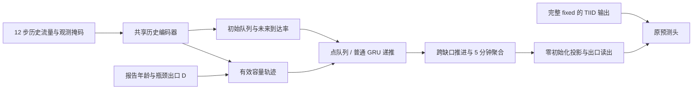

# H1：事故容量与点队列辅助分支

开发日期：2026-10-09。当前交付第一阶段的可微模块、同输入递推参照、物理数据契约核验和一键工程检查。尚未完成真实数据的正式训练或效果比较。第二阶段 CTM 只有经过数值测试的走廊内核，尚未接入实际路网。

研究方向更新：用户明确以“事故—通行能力变化—空间传播”改进 IGSTGNN，采用有限观测下的状态/参数估计；封道与处置日志不作为第一版前提。H1 保留为局部队列参照，后续按[容量与空间传播方案](incident_capacity_propagation_design_20261009.md)推进多站走廊接口与空间模块。以下记录 H1 已实现版本及其工程限制，不代表传播模块已经完成。

最新状态：服务器作业 **1163672** 已完成 21 项测试、真实包审计和 V100 合成模型工程检查，退出码 0。两臂初始差均为 0、各完成 2 次更新。当前仍为 `PHYSICAL_CONTRACT_REQUIRED`，详见[服务器结果解读](incident_physics_h1_server_check.md)。无需重复无参数工程检查，下一步补齐真实物理依据。

后续数据核验已推进：确认发布者采用区间起始标签，取得历史车道元数据，并完成去重训练 X 与完整匝道元数据预筛。当前 482 对候选中 217 对通过元数据预筛，尚无认证瓶颈；详见[物理数据契约核验](incident_physics_data_contract.md)。真实模型训练仍待单位转换链、边界和校准依据。

服务器数据准备请使用 `bash experiments/chronological/run_incident_physics_evidence.sh`。该 CPU 入口附带元数据并生成具体原记录日期清单；无需再次运行本页的 H1 合成模型检查。取得官方原记录后，可给新入口传入文件路径进行比对。

上述数据准备已在服务器作业 **1163917** 通过，14 项测试成功、退出码 0，尚未传入官方原始流量文件。当前应补原记录后做单位比对，无需再重复无参数准备；见[数据准备服务器结果](incident_physics_evidence_server_check.md)。

## 1. 研究问题与思想来源

研究问题是：在完整 IGSTGNN/fixed 基础上，事故条件能否通过有效容量、供需积累和队列记忆，提供有用的未来状态特征？成功标准仍是同协议下超过完整 fixed；P2 的局部门控作用不等于新模块已经有效。

- [Daganzo 的 CTM，1994](https://doi.org/10.1016/0191-2615(94)90002-7)：继承守恒、发送/接收约束和时变事故容量思想。本轮方法核读用的是其 [1993 前驱报告](https://escholarship.org/content/qt0b6612tk/qt0b6612tk.pdf)。第一阶段是点队列，不能称为完整 CTM。
- [Tang、Jin、Ozbay，Transportation Science 2024](https://pubsonline.informs.org/doi/10.1287/trsc.2024.0526)：借鉴有语义的物理参数及神经模型与物理约束结合。已读作者稿中的 encoder/decoder 都是 NN，CTM 是独立约束算子；本实现的直接队列递推是自己的设计选择。
- [Lu 等，TR-C 2023](https://doi.org/10.1016/j.trc.2023.104224)：交通状态与队列轮廓的可微计算近邻；本轮只有摘要与方法预览阅读，不能声称复现了其模型。
- [Wang 等，SIS-CTM，Physica A 2024](https://doi.org/10.1016/j.physa.2024.129536)：事故容量与跨学科传播建模已有前人研究。本候选不主张首次将事故与交通物理结合。

这里待验证的选择，是在弱报告条件下将物理状态作为完整主干的辅助信息，并用同输入、同记忆类型的非物理分支区分递推约束的增量。文献提供机制依据，不提供本数据上的收益证据。

## 2. 已实现的数据流



实现位置：`src/models/incident_queue.py`。原 `src/models/igstgnn.py` 未修改。扩展类复用 ICSF、图构造、五层分解主干与 TIID，在 TIID 后的 `step_hidden` 加入新分支输出。只允许 `report_location_v1`、`time_response=fixed`、无 ACDG 的起点。

物理输入由 `src/utils/traffic_physics_contract.py` 单独构造：

- 只接受 X 的 `[B,12,N]` 原始流量和布尔有效掩码；26 槽整窗被拒绝。缺测填充值不作为真实观测，真实零流量保留。
- 每个经过声明的瓶颈有一个到达观测站和一个离去观测站。第一版只向该瓶颈的离去站读出，不自动把 496 个检测器当成 496 个队列。
- 报告特征是 `report_age/5` 和离去站的三维 D。D 支持只定义候选关联，不是真实受影响标签；不从 D2 的符号推断上下游。
- 单位必须声明为每 5 分钟车辆数或车辆/小时，且为全车道总量；前者乘 12 转为车辆/小时。没有默认单位猜测。

历史 GRU 编码两条率及各自的有效掩码。历史状态决定初始队列、到达率基值和斜率；新增分支的报告条件只参与容量参数。原 fixed 本来已有事故信息，因此移除新增报告条件也不等于全模型无事故。

### 队列状态与当前建模假设

队列 Q 单位为车辆，λ、C、d 为车辆/小时，Δt 为小时：

```text
d[k]   = min(C[k], λ[k] + Q[k] / Δt)
Q[k+1] = Q[k] + Δt × (λ[k] - d[k])
```

实现使用微小负舍入误差的非负截断，检查内部守恒残差。没有空间长度或有限储存约束，因此不能表达空间回溢。

第一版容量曲线为 `C[k] = C0 × (1 - a × exp(-t[k]/τ))`：

- `a = 0.95 × sigmoid(.) × candidate_support`，τ 在 5–180 分钟之间。
- 这是单调恢复的低维先验，不是已观察到的封道恢复曲线；事故可继续恶化或反复变化，此模型暂不表达。
- 初始 Q 在声明的 `queue_scale` 范围内，之后可超过该尺度；它不是有限道路储存容量。到达基值在 0–3C0 之间，60 分钟内相对斜率在 ±0.5 之间。
- 上述范围是可复查的模型设定，不是从当前数据识别出的物理事实。Q、有效容量与恢复时间没有独立真值认证。
- 容量恢复和队列清空由不同机制决定，没有强制的先后次序。

以最后历史区间的结束边界为内部时间原点，默认以 1 分钟推进 70 步：先覆盖 10 分钟未观测缺口，再覆盖 12 个 5 分钟目标区间。队列状态取每个内部步结束值，流率取对应步率，再聚合到目标区间。X 末标签与 Y 首标签相差 15 分钟，不等于有 15 分钟完整缺口。源区间标签的 start/end 含义仍需证据。

报告是当前预测时点的条件，也用于缺口内隐状态推断；本实现不把报告时间解释为事故起点，不声称在报告出现前就已在线获取它。当前仍是条件性离线研究。

### 普通递推参照

`mode=recurrent` 共用同样的历史编码器、初始状态构造、到达率和容量参数化、时间步、候选支持及输出位置，用 4 维 GRUCell 替换队列守恒转移。两臂的共同参数初始化一致；自由递推状态不解释为车辆数。

默认 hidden=8、投影维数=256 时，点队列分支增加 1,509 个参数，GRU 参照增加 1,617 个参数。多出的 108 个参数单独披露，不声称严格等参数。这个参照用于检验受约束转移的价值；若以后增加速度、占有率或其他信息，参照也必须得到同样信息。

两臂使用无偏置零初始化投影，初始输出逐元素等于同权重 fixed。第一步能更新投影，第二步再检查历史编码器梯度激活。零投影导致首步上游梯度为零是设计结果。

内部队列守恒不保证经过任意神经预测头后的最终流量也守恒。无支持节点的新分支直接增量为零，但联合训练能改变共同主干，不能据此保证训练后该区域最终预测不变。

## 3. 物理数据契约

`audit_incident_physics.py` 核验包身份、节点顺序、名义时间偏移、原传感器表哈希，并生成：

| 文件 | 含义 |
|---|---|
| `contract_template.json` | 尚未解决的契约，不可直接用来运行真实物理分支 |
| `train_history_profiles.csv` | 仅训练 X 的窗口加权分位数；不是去重校准样本，也不是容量估计 |
| `sensor_inventory.csv` | 道路、方向、里程与未确认单位的元数据 |
| `candidate_postmile_neighbors.csv` | 同道路/方向内的里程相邻候选；物理方向和直接连接均未认证 |
| `summary.json` | 数据身份、时序检查和缺失证据 |

当前缺少四类证据：流量单位与车道聚合、源时间区间标签、瓶颈到达/离去观测映射、容量及队列尺度校准。传感器 `Length` 字段不能直接认作 CTM cell 长度；学习图也不是道路连接证据。

后续应复制生成的模板，保留包指纹和站序，依据实际资料填写上述项，并给每个瓶颈提供：`id`、`arrival_station_id`、`departure_station_id`、相同的 `readout_station_id`、`capacity_veh_per_hour`、`queue_scale_vehicles` 和 `boundary_evidence`。`evidence` 中记录具体文件、字段、页码或校准产物。参数拟合和映射选择只能使用训练范围及独立道路资料，不能利用验证 Y 挑瓶颈或调参数。

真实工程检查要求状态为 `declared_for_conditional_screening`、范围为 `conditional_offline_screening`，且 `main_training_ready=false`。验证器检查声明的完整性、身份和数值条件，不独立认证证据内容的真实性。不能只填占位说明就把未知物理条件视为已解决。

## 4. 服务器一键运行

服务器更新到本分支后，在仓库根目录、已有 Slurm 资源分配中执行：

```bash
bash experiments/chronological/run_incident_physics_h1.sh
```

沿用 `igstgnn` 环境。此阶段可用 CPU；分配 GPU 时自动使用可见 CUDA。建议 3 核、8GB 内存、30 分钟作为工程/I/O 预留，不是服务器实测耗时。脚本不包含 Git、安装、下载或调度提交命令。

默认数据路径为 `../data/chronological/Contra_Costa_v8_dev`，传感器表为 `../data/xtraffic/Contra_Costa/sensors.csv`。需要变更时可设置 `PHYSICS_DATA_DIR`、`PHYSICS_SENSORS`、`PHYSICS_DEVICE`、`PHYSICS_PYTHON`；普通运行无需参数。

当前运行顺序是 35 项单元测试（含后续新增的 14 项证据准备/启动器测试）→ 真实包只读核验 → 人工 3 节点、完整 5 层主干的两臂工程检查。作业1163672所用版本当时为21项。每臂仅 2 次优化器更新。它不加载旧最佳 checkpoint，也不进行整轮训练或验证集选模。

预期结束状态：

```text
H1_ENGINEERING_CHECK_PASS
H1_PREPARATION_COMPLETE
readiness = PHYSICAL_CONTRACT_REQUIRED
full_training_started = false
ctm_real_data_enabled = false
Workflow exit code: 0
```

`PHYSICAL_CONTRACT_REQUIRED` 表示真实数据的物理含义尚需核实，不是测试失败，也不是正式训练已就绪。请回传日志末尾的汇总；若失败，保留并回传 `run.log`。新结果在 `experiments/chronological_runs/contra_physics_h1_时间_随机后缀/`，不会覆盖历史 P2 目录。

契约有实据并核验后，才使用可选入口：

```bash
bash experiments/chronological/run_incident_physics_h1.sh /path/to/declared_contract.json
```

这只额外检查预定的前两个训练窗口，仍各两次更新，不是正式训练。若这两个窗口没有覆盖任何声明瓶颈，程序会停止；不会搜索更有利的目标样本。`DECLARED_CONTRACT_VALIDATED_FOR_ENGINEERING_CHECK` 也不代表独立在线资格或科学有效性。

## 5. 本地验证及下一阶段

2026-10-09 在 Windows/Git Bash、Python 3.10.18、PyTorch 2.3.1 CPU 下完成一键流程，21 项新测试全部通过、没有跳过。另通过原有 6 项论文模块及 3 项 ACDG 回归测试，共 30 项。原模型测试首次受到 Windows 沙箱临时目录写权限限制，改用工作区内临时目录后全部通过，没有改动原测试或模型。核验本地完整包 3,604/917 个 train/val 窗口、496 站，生成 482 对里程相邻候选。新测试覆盖解析队列解、非负和容量边界、梯度、CTM 总车辆守恒/CFL、历史掩码、未来槽隔离、共同初始输出以及异常清理。CPU 两臂各两次更新通过；随后服务器作业 1163672 又完成了 V100 上的合成模型检查。

包指纹：

```text
summary.json          7611ac36a0e8ac5fdfb11a9d09487d3505f0fae24b0da05af7cbdcd24f113dd7
context_manifest.json b08796709e476c6d86720e785ec99503dbd18ee1a1807a1ab393f3cd8d8b209f
```

当前真实物理契约尚未解决，因此未执行真实窗口模型工程检查、完整配对训练或预测收益检验。下一阶段首先补齐契约，然后开发冻结协议下的 fixed/自由递推/点队列训练、续跑和同端点评估；不拿本次两次更新的 loss 作为效果比较。

第二阶段的 `ctm_corridor_step` 已实现无匝道、有方向走廊的共享界面流量、三角基本图、固定拥挤储存、CFL 检查。真实接入仍需要道路长度、方向、边界需求与供给、匝道处理和状态观测依据；到达与供给的未来值必须预测，不能读取未来真值。只有第一阶段提供值得继续检验的信号且这些条件具备后，才开发空间传播模块。
